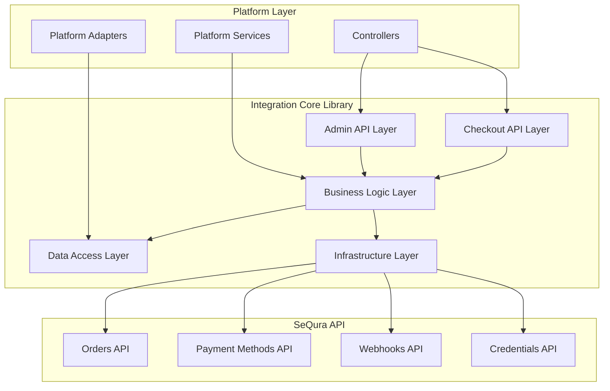
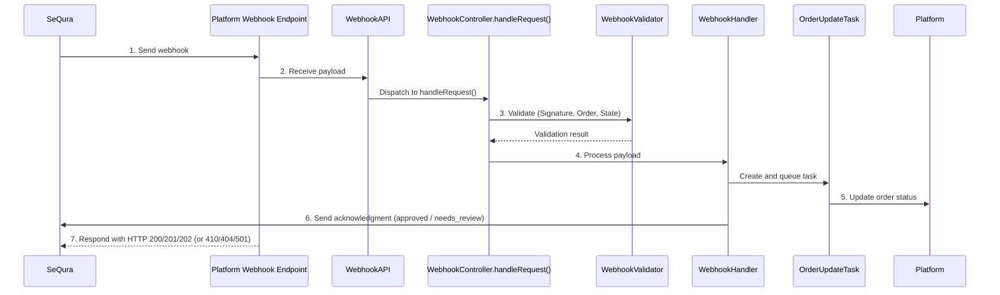

# SeQura Integration Core Library

## Table of Contents

- [📘 Overview](#📘-overview)
  - [What is the SeQura Integration Core?](#what-is-the-sequra-integration-core)
  - [Problems Solved by Integration Core](#problems-solved-by-integration-core)
- [🛠 Installation](#🛠-installation)
    - [Requirements](#requirements)
    - [Installing via Composer](#installing-via-composer)
- [🚀 Quick Start Guide](#🚀-quick-start-guide)
    - [Services](#services)
    - [Repositories](#repositories)
    - [Using the BootstrapComponent](#using-the-bootstrapcomponent)
        - [Core Infrastructure Services (Required)](#core-infrastructure-services-required)
        - [Business Logic Services (Required)](#business-logic-services-required)
        - [Order Management Services (Required)](#order-management-services-required)
        - [Integration Services (Required)](#integration-services-required)
        - [Widget Services (Optional but Recommended)](#widget-services-optional-but-recommended)
        - [Repository Registrations (Required)](#repository-registrations-required)
        - [Minimum Implementation Checklist](#minimum-implementation-checklist)
- [📦 Platform Integration Examples](#📦-platform-integration-examples)
- [📚 Public API Documentation](#📚-public-api-documentation)
  - [Architecture Overview](#architecture-overview)
  - [Infrastructure Components](#infrastructure-components)
  - [Admin API Layer](#admin-api-layer)
  - [Checkout API Layer](#checkout-api-layer)
  - [Webhook API Layer](#webhook-api-layer)
  - [API Proxy Layer](#api-proxy-layer)
  - [Task Execution System](#task-execution-system)
  - [ORM & Data Persistence Layer](#orm--data-persistence-layer)
  - [Multi-store Context Management](#multi-store-context-management)
  - [SeQura API Proxy Layer](#sequra-api-proxy-layer)
- [🧩 Customization and Extensibility](#-customization-and-extensibility)

## 📘 Overview

### What is the SeQura Integration Core?

The `sequra/integration-core` library is a platform-agnostic PHP library that provides the foundational business logic and API communication layer for integrating SeQura payment methods into any e-commerce platform. It is built following clean architecture principles, ensuring that the payment processing logic remains centralised and consistent across implementations.

One of the main goals of the library is to provide this shared, centralised logic, while still allowing for customisation and extension to adapt behaviour and structure to different systems. At the same time, it avoids dependencies on system-specific or third-party components, relying only on pure PHP and vanilla JavaScript to keep the core flexible, lightweight, and portable.

The library is designed with the following non-functional requirements, which are to be consistently upheld across all SeQura integrations:
- **Platform-agnostic**: Works with any PHP-based e-commerce platform
- **Modular**: Components can be used independently or together
- **Extensible**: Allows custom implementations of interfaces
- **Testable**: Clear separation of concerns with dependency injection

These attributes are not just desirable qualities, but mandatory design goals that ensure long-term maintainability and alignment with SeQura’s architectural principles. They represent core priorities, though not the entirety of the non-functional requirements defined for the CORE. For a complete overview, refer to the architectural documentation, which describes in detail how these and other quality attributes shape both the design and implementation of the system.

## Problems Solved by Integration Core

### Architectural Overview

To ensure maintainability and alignment with clean architecture principles, the **integration-core** library separates responsibilities into distinct layers, following the Onion Architecture model.  
This structure avoids mixing concerns, keeps the core logic centralised, and ensures consistency across all SeQura integrations.

---

#### CORE – Infrastructure
Provides the **technical foundation** to support business logic, ensuring consistency and portability across platforms:

- **Logging** – unified logger for consistent monitoring and troubleshooting
- **HTTP Infrastructure** – standardized communication with external services
- **ORM Abstraction** – repository pattern for persistence without platform lock-in
- **Task Runner** – scheduling and background task execution

---

#### CORE – Business Logic
Encapsulates **SeQura’s domain logic**, centralized and reusable across all platforms:

- **API Facades** – simplified access to SeQura API endpoints
- **Checkout Services** – consistent handling of payment initiation and processing
- **Order Management Services** – standardized order lifecycle handling
- **Plugin Administration Services** – centralized configuration and credential management
- **API Proxy & JS Library** – abstraction for frontend–backend communication

---

#### Integration Interfaces
Defines **extension points** that allow business logic to interact with diverse e-commerce systems without leaking system-specific dependencies.

---

#### Concrete Integrations
Implements **shop-specific adapters and extensions**, bridging CORE with the host platform:

- **Platform-specific Implementations** – e.g., order state transitions, checkout extensions
- **UI/UX Extensions** – extensions to checkout or order screens
- **Bootstrap Components** – initialization of the integration in the host platform
- **Event Listeners** – handling shop-specific events (orders, payments, refunds, etc.)

## 🛠 Installation

### Requirements

- **PHP**: >= 7.2
- **Extensions**: `json`, `ctype`, `mbstring`
- **Composer**: For dependency management

### Installing via Composer

```bash
composer require sequra/integration-core
```

## 🚀 Quick Start Guide

The library uses a **bootstrap pattern** for initialization. This step must be performed after installing the library.

Its main goal is to ensure **independence from the dependency injection (DI) mechanisms** of different systems, and to provide a way for services to be **overridden or extended** in concrete platform integrations.

The **dependency inversion principle** is applied here as a best practice to achieve this flexibility, but it is not the primary objective of the bootstrap process.

This library provides a `BootstrapComponent` class that should be extended by the platform integration. The `BootstrapComponent` is responsible for registering all required services, repositories and dependencies.

Before going deeper into the BootstrapComponent, let's see take a quick look at the concept of Services, Repositories and how to register them.

### Services

Services are intended to handle use-cases. The way you should use to register a new Service is through the `SeQura\Core\Infrastructure\ServiceRegister` class. The following example shows how to register the implementation for the SeQura\WC\Services\Core\Encryptor service required to encrypt and decrypt text.

```php
ServiceRegister::registerService(
    EncryptorInterface::class,
    static function () {
        return new Encryptor();
    }
);
```
For retrieving the instance, use this method instead:

```php
$encryptor = ServiceRegister::getService(EncryptorInterface::class);
```

### Repositories

Repositories define a way to read and write data to a datasource (like a database) and map raw data to entities. They must  implement `SeQura\Core\Infrastructure\ORM\Interfaces\RepositoryInterface`. The integration-core provides for this the `SeQura\Core\Infrastructure\ORM\RepositoryRegistry`, similar to the service alternative.

To register a new repository implementation, see the following example:

```php
RepositoryRegistry::registerRepository( ConfigEntity::class, EntityRepository::class );
```

To retrieve a repository:

```php
$configRepository = RepositoryRegistry::getRepository(ConfigEntity::class);
```

### Using the BootstrapComponent

To use the `BootstrapComponent`, extend it in your platform integration and implement the `init` method to register all required services and repositories. Here's an example for a Magento 2 integration:

```php
namespace YourNamespace\Integration;

use SeQura\Core\BusinessLogic\BootstrapComponent;

class Bootstrap extends BootstrapComponent
{
    public static function init(): void
    {
        // Customize initialization logic here as needed. 
        // For example, register constant values required by services.

        // Then call the parent init method.
        parent::init();
    }

    protected static function initRepositories(): void
    {
        parent::initRepositories();
        // Register your repositories here
    }

    protected static function initServices(): void
    {
        parent::initServices();
        // Register your services here
    }
}
```
After implementing the `Bootstrap` class, you can call `Bootstrap::init()` in your platform's bootstrap process to initialize the integration core library.

Here are the essential components your bootstrap implementation must provide:

### Core Infrastructure Services (Required)

These services must be implemented by every platform integration:

#### 1. Configuration Service
```php
// Must extend SeQura\Core\Infrastructure\Configuration\Configuration
class PlatformConfiguration extends Configuration 
{
    // Platform-specific configuration storage and retrieval
    public function getConfigValue($key, $defaultValue = null) { /* */ }
    public function setConfigValue($key, $value) { /* */ }
    public function getAsyncProcessUrl($guid) { /* */ }
    // ... other required methods
}
```

#### 2. Logger Service
```php
// Must implement SeQura\Core\Infrastructure\Logger\Interfaces\ShopLoggerAdapter
class PlatformLogger implements ShopLoggerAdapter
{
    public function logMessage($level, $message, array $context = []) { /* */ }
    public function isLoggingEnabled() { /* */ }
    // ... other required methods
}
```

#### 3. Encryptor Service
```php
// Must implement SeQura\Core\BusinessLogic\Utility\EncryptorInterface
class PlatformEncryptor implements EncryptorInterface
{
    public function encrypt($data) { /* */ }
    public function decrypt($data) { /* */ }
}
```

### Business Logic Services (Required)

#### 4. Store Service
```php
// Must implement StoreServiceInterface
class PlatformStoreService implements StoreServiceInterface
{
    public function getStoreId() { /* */ }
    public function getStoreName() { /* */ }
    public function getStores() { /* */ }
    public function getDefaultStore() { /* */ }
}
```

#### 5. Version Service
```php
// Must implement VersionServiceInterface
class PlatformVersionService implements VersionServiceInterface
{
    public function getShopName() { /* */ }
    public function getShopVersion() { /* */ }
    public function getModuleVersion() { /* */ }
}
```

#### 6. Category Service
```php
// Must implement CategoryServiceInterface
class PlatformCategoryService implements CategoryServiceInterface
{
    public function getCategory($categoryId) { /* */ }
    public function getAllCategories() { /* */ }
}
```

#### 7. Product Service
```php
// Must implement ProductServiceInterface
class PlatformProductService implements ProductServiceInterface
{
    public function getProductById($productId) { /* */ }
    public function getProductsByIds(array $productIds) { /* */ }
}
```

### Order Management Services (Required)

#### 8. Order Creation Service
```php
// Must implement OrderCreationInterface
class PlatformOrderCreation implements OrderCreationInterface
{
    public function createOrder($cartData, $sequraOrderReference) { /* */ }
    public function updateOrderStatus($orderId, $status) { /* */ }
}
```

#### 9. Merchant Data Provider
```php
// Must implement MerchantDataProviderInterface
class PlatformMerchantDataProvider implements MerchantDataProviderInterface
{
    public function getMerchantData($orderId) { /* */ }
    public function getOrderItems($orderId) { /* */ }
    public function getShippingInfo($orderId) { /* */ }
}
```

#### 10. Order Report Service
```php
// Must implement OrderReportServiceInterface
class PlatformOrderReportService implements OrderReportServiceInterface
{
    public function getOrdersForReporting($from, $to) { /* */ }
    public function markOrderAsReported($orderId) { /* */ }
}
```

### Integration Services (Required)

#### 11. Selling Countries Service
```php
// Must implement SellingCountriesServiceInterface
class PlatformSellingCountriesService implements SellingCountriesServiceInterface
{
    public function getSellingCountries() { /* */ }
    public function getCountryByCode($countryCode) { /* */ }
}
```

#### 12. Disconnect Service
```php
// Must implement DisconnectServiceInterface
class PlatformDisconnectService implements DisconnectServiceInterface
{
    public function disconnect() { /* */ }
    public function cleanup() { /* */ }
}
```

### Widget Services (Optional but Recommended)

#### 13. Widget Configurator
```php
// Must implement WidgetConfiguratorInterface
class PlatformWidgetConfigurator implements WidgetConfiguratorInterface
{
    public function getWidgetAssetsHtml() { /* */ }
    public function getWidgetScriptUrl() { /* */ }
    public function getSelectors() { /* */ }
}
```

#### 14. Mini Widget Messages Provider
```php
// Must implement MiniWidgetMessagesProviderInterface
class PlatformMiniWidgetMessagesProvider implements MiniWidgetMessagesProviderInterface
{
    public function getMessages($productId, $price) { /* */ }
}
```

### Repository Registrations (Required)

Your bootstrap must also register repositories for entity persistence:

```php
protected static function initRepositories(): void
{
    parent::initRepositories();
    
    // Register entity repositories with your platform's storage implementation
    RepositoryRegistry::registerRepository(ConfigEntity::class, PlatformBaseRepository::class);
    RepositoryRegistry::registerRepository(QueueItem::class, PlatformQueueRepository::class);
    RepositoryRegistry::registerRepository(SeQuraOrder::class, PlatformOrderRepository::class);
    // ... register all required entities
}
```

### Minimum Implementation Checklist

✅ **Infrastructure Layer**
- [ ] Configuration service extending `Configuration`
- [ ] Logger service implementing `ShopLoggerAdapter`
- [ ] Encryptor service implementing `EncryptorInterface`
- [ ] Serializer service (usually `JsonSerializer` is sufficient)

✅ **Platform Integration Layer**
- [ ] Store service implementing `StoreServiceInterface`
- [ ] Version service implementing `VersionServiceInterface`
- [ ] Category service implementing `CategoryServiceInterface`
- [ ] Product service implementing `ProductServiceInterface`

✅ **Order Management Layer**
- [ ] Order creation service implementing `OrderCreationInterface`
- [ ] Merchant data provider implementing `MerchantDataProviderInterface`
- [ ] Order report service implementing `OrderReportServiceInterface`

✅ **Business Services Layer**
- [ ] Selling countries service implementing `SellingCountriesServiceInterface`
- [ ] Disconnect service implementing `DisconnectServiceInterface`

✅ **Data Persistence Layer**
- [ ] Repository implementations for all core entities
- [ ] Database schema creation/migration support

✅ **Optional Enhancement Layer**
- [ ] Widget configurator for promotional widgets
- [ ] Mini widget messages provider
- [ ] Shop order statuses service

This comprehensive list ensures your platform integration provides all necessary components for the SeQura Core library to function properly across all supported use cases.

## 📦 Platform Integration Examples

You can take a look at existing implementations of the integration-core library in the following repositories:
- [Magento 2](https://github.com/sequra/magento2-core)
- [WooCommerce](https://github.com/sequra/woocommerce-sequra)

## 📚 Public API Documentation

### Architecture Overview

The Core will be implemented by following the onion architecture comprised of multiple concentric layers interfacing with each other towards the core that represents the business logic, as displayed in the diagram below. Onion Architecture is based on the inversion of control principle where inner layers' dependencies are abstracted as required interfaces:



The library structure is organized the following way:

```
SeQura\Core\
├── BusinessLogic/
│   ├── AdminAPI/           # Admin panel management
│   ├── CheckoutAPI/        # Checkout process handling
│   ├── DataAccess/         # Repository interfaces and entities
│   ├── Domain/             # Core domain services
│   ├── Providers/          # Service providers
│   ├── SeQuraAPI/          # API client implementations
│   ├── TransactionLog/     # Transaction logging
│   ├── Utility/            # Helper utilities
│   ├── Webhook/            # Webhook processing
│   └── WebhookAPI/         # Webhook API handling
└── Infrastructure/
    ├── Configuration/      # Configuration management
    ├── Http/               # HTTP client abstractions
    ├── Logger/             # Logging interfaces
    ├── ORM/                # Data persistence abstractions
    └── ServiceRegister/    # Dependency injection container
```

### Infrastructure Components

The **Infrastructure Components** form the foundation of any SeQura integration, providing essential services for logging, HTTP communication, configuration storage, task execution, and data persistence. Understanding and properly implementing these components is critical for a robust, scalable integration.

#### Overview

The infrastructure layer follows **Dependency Inversion Principle** and uses **Abstract Factory Pattern** to provide platform-agnostic implementations of core services while allowing platform-specific customizations through interface implementations.

#### Core Infrastructure Components

##### 1. **HTTP Client Infrastructure**
- **Purpose**: Handles all HTTP communication with SeQura APIs
- **Features**: Request/response handling, SSL verification, proxy support, timeout management
- **Extensibility**: Custom authentication, retry logic, caching

##### 2. **Logging Infrastructure** 
- **Purpose**: Centralized logging for debugging, monitoring, and audit trails
- **Features**: Multiple log levels, structured logging, log rotation, remote logging
- **Integration**: Platform logging systems, external monitoring tools

Implementation example based on Magento 2:

```php
namespace YourNamespace\Integration\Core\Infrastructure;

use SeQura\Core\Infrastructure\Configuration\Configuration;
use SeQura\Core\Infrastructure\Logger\Interfaces\ShopLoggerAdapter;
use SeQura\Core\Infrastructure\Logger\LogData;
use SeQura\Core\Infrastructure\Logger\Logger;
use SeQura\Core\Infrastructure\ServiceRegister;
use SeQura\Core\Infrastructure\Singleton;
use Sequra\Core\Services\BusinessLogic\ConfigurationService;
use Psr\Log\LoggerInterface;

class LoggerService extends Singleton implements ShopLoggerAdapter
{
    /**
     * Singleton instance of this class.
     *
     * @var static
     */
    protected static $instance;
    /**
     * Log level names for corresponding log level codes.
     *
     * @var array<string>
     */
    private static $logLevelName = [
        Logger::ERROR => 'error',
        Logger::WARNING => 'warning',
        Logger::INFO => 'info',
        Logger::DEBUG => 'debug',
    ];
    /**
     * Magento logger interface.
     *
     * @var LoggerInterface
     */
    private $logger;

    /**
     * Logger service constructor.
     *
     * @param LoggerInterface $logger Magento logger interface.
     */
    public function __construct(LoggerInterface $logger)
    {
        parent::__construct();

        $this->logger = $logger;

        static::$instance = $this;
    }

    /**
     * Logs message in the system.
     *
     * @param LogData $data
     */
    public function logMessage(LogData $data): void
    {
        /** @var ConfigurationService $configService */
        $configService = ServiceRegister::getService(Configuration::CLASS_NAME);
        $minLogLevel = $configService->getMinLogLevel();
        $logLevel = $data->getLogLevel();

        if (($logLevel > $minLogLevel) && !$configService->isDebugModeEnabled()) {
            return;
        }

        $message = 'SEQURA LOG: 
            Date: ' . date('d/m/Y') . '
            Time: ' . date('H:i:s') . '
            Log level: ' . self::$logLevelName[$logLevel] . '
            Message: ' . $data->getMessage();
        $context = $data->getContext();
        if (!empty($context)) {
            $message .= '
            Context data: [';
            foreach ($context as $item) {
                $message .= '"' . $item->getName() . '" => "' . print_r($item->getValue(), true) . '", ';
            }

            $message .= ']';
        }
        \call_user_func([$this->logger, self::$logLevelName[$logLevel]], $message);
    }
}
```

##### 3. **Configuration Infrastructure**
- **Purpose**: Secure storage and retrieval of integration settings
- **Features**: Encryption, validation, environment management, multi-store support
- **Security**: Credential protection, secure defaults, audit logging

Implementation example based on Magento 2:

```php
namespace YourNamespace\Integration\Core\Infrastructure;

use Magento\Framework\Exception\NoSuchEntityException;
use Sequra\Core\Helper\UrlHelper;
use SeQura\Core\Infrastructure\Configuration\Configuration;

class ConfigurationService extends Configuration
{
    public const MIN_LOG_LEVEL = 1;
    private const INTEGRATION_NAME = 'Magento2';

    /**
     * @var UrlHelper
     */
    private $urlHelper;

    /**
     * @param UrlHelper $urlHelper
     */
    public function __construct(UrlHelper $urlHelper)
    {
        parent::__construct();

        $this->urlHelper = $urlHelper;
    }

    /**
     * @inheritDoc
     */
    public function getIntegrationName(): string
    {
        return self::INTEGRATION_NAME;
    }

    /**
     * @inheritDoc
     *
     * @throws NoSuchEntityException
     */
    public function getAsyncProcessUrl($guid): string
    {
        $params = [
            'guid' => $guid,
            'ajax' => 1,
            '_nosid' => true,
        ];

        return $this->urlHelper->getFrontendUrl('sequra/asyncprocess/asyncprocess', $params);
    }
}
```

##### 4. **Task Execution Infrastructure**
- **Purpose**: Background task processing and queue management
- **Features**: Priority queues, retry mechanisms, progress tracking, failure recovery
- **Scalability**: Distributed processing, load balancing, horizontal scaling

##### 5. **ORM Infrastructure**
- **Purpose**: Database abstraction and entity management
- **Features**: Query building, connection management, transaction handling, migration support
- **Performance**: Connection pooling, query optimization, caching

#### Key Infrastructure Benefits

1. **Reliability**: Comprehensive error handling and retry mechanisms
2. **Security**: Encryption, secure defaults, audit logging
3. **Performance**: Caching, connection pooling, resource monitoring
4. **Scalability**: Distributed processing, load balancing capabilities
5. **Monitoring**: Detailed metrics, health checks, alerting
6. **Maintainability**: Structured logging, configuration management
7. **Flexibility**: Platform-agnostic interfaces with custom implementations

#### Infrastructure Best Practices

1. **Error Handling**: Implement comprehensive error handling with appropriate retry logic
2. **Security**: Encrypt sensitive data, use secure defaults, audit all changes
3. **Performance**: Monitor resource usage, implement caching strategies
4. **Reliability**: Use transactions, implement health checks, monitor system health
5. **Observability**: Implement detailed logging and metrics collection
6. **Configuration**: Validate all configuration, provide migration paths
7. **Testing**: Test infrastructure components thoroughly with realistic scenarios

### Admin API Layer

The **AdminAPI layer** in the SeQura integration-core library provides a standardized interface for platform integrations to interact with SeQura's administrative functionalities. It serves as the primary entry point for all admin panel operations, offering a clean separation between business logic and platform-specific implementations.

#### Overview

The AdminAPI layer follows a **Controller-Service pattern** with **Aspect-Oriented Programming (AOP)** for cross-cutting concerns like error handling and store context management.

#### Core Components

##### 1. **AdminAPI Main Class**
- **Purpose**: Central factory for accessing all admin controllers
- **Pattern**: Singleton with method chaining and aspect weaving
- **Key Method**: `get()` - Returns an instance with error handling applied

##### 2. **Controllers** (9 Main Controllers)

###### **ConnectionController**
- **Purpose**: Manages SeQura API connection and authentication
- **Key Methods**:
  - `getOnboardingData()` - Retrieves connection setup data
  - `isConnectionDataValid()` - Validates API credentials
  - `validateConnectionData()` - Full validation with error details
  - `saveConnectionData()` - Persists connection settings
  - `connect()` - Establishes connection with onboarding

###### **PaymentMethodsController**
- **Purpose**: Manages available payment methods and products
- **Key Methods**:
  - `getPaymentMethods()` - Gets merchant's payment methods
  - `getAllAvailablePaymentMethods()` - Gets formatted payment methods for all merchants
  - `getProducts()` - Retrieves merchant products

###### **GeneralSettingsController**
- **Purpose**: Handles general configuration settings
- **Key Methods**:
  - `getGeneralSettings()` - Retrieves current settings
  - `saveGeneralSettings()` - Updates configuration
  - `getShopCategories()` - Gets platform categories

###### **CountryConfigurationController**
- **Purpose**: Manages country-specific configurations
- **Key Methods**:
  - `getSellingCountries()` - Gets available selling countries
  - `getCountryConfigurations()` - Retrieves country settings
  - `saveCountryConfiguration()` - Updates country settings

###### **PromotionalWidgetsController**
- **Purpose**: Manages promotional widget settings
- **Key Methods**:
  - `getWidgetSettings()` - Gets widget configuration
  - `saveWidgetSettings()` - Updates widget settings

###### **OrderStatusSettingsController**
- **Purpose**: Manages order status mapping
- **Key Methods**:
  - `getOrderStatusSettings()` - Gets status mappings
  - `saveOrderStatusSettings()` - Updates status mappings

###### **TransactionLogsController**
- **Purpose**: Handles transaction logging and monitoring
- **Key Methods**:
  - `getTransactionLogs()` - Retrieves transaction history
  - `getTransactionDetails()` - Gets specific transaction info

###### **DisconnectController**
- **Purpose**: Handles SeQura integration disconnection
- **Key Methods**:
  - `disconnect()` - Safely disconnects integration
  - `cleanup()` - Performs cleanup operations

###### **DeploymentsController**
- **Purpose**: Manages deployment environments
- **Key Methods**:
  - `getAllDeployments()` - Gets all deployments
  - `getNotConnectedDeployments()` - Gets unconnected deployments

##### 3. **Aspects** (Cross-cutting Concerns)

###### **ErrorHandlingAspect**
- **Purpose**: Provides consistent error handling across all controllers
- **Features**:
  - Catches and translates exceptions
  - Logs errors with context
  - Returns standardized error responses
  - Handles API-specific exceptions (unauthorized, invalid parameters)

###### **StoreContextAspect**
- **Purpose**: Manages multi-store context
- **Features**:
  - Sets store context before method execution
  - Ensures store-specific data isolation
  - Handles store switching

##### 4. **Request/Response Objects**
- **Requests**: Strongly-typed input objects that validate and transform data
- **Responses**: Structured output objects with `toArray()` methods for serialization

#### Practical Example: General Settings Management

Here's a comprehensive example showing how the AdminAPI is used in a Magento admin controller:

```php
<?php
// Magento Admin Controller using AdminAPI
class GeneralSettingsController extends AbstractConfigurationAction
{
    /**
     * Get shop categories for configuration dropdown
     */
    protected function getShopCategories(): Json
    {
        // Use AdminAPI with store context and error handling
        $response = AdminAPI::get()
            ->generalSettings($this->storeId)  // Store context applied
            ->getShopCategories();             // Business logic call
        
        $this->addResponseCode($response);     // Handle HTTP response codes
        return $this->result->setData($response->toArray());
    }

    /**
     * Get current general settings
     */
    protected function getGeneralSettings(): Json
    {
        $response = AdminAPI::get()
            ->generalSettings($this->storeId)
            ->getGeneralSettings();
        
        $this->addResponseCode($response);
        return $this->result->setData($response->toArray());
    }

    /**
     * Save new general settings
     */
    protected function setGeneralSettings(): Json
    {
        // Extract and validate POST data
        $data = $this->getSequraPostData();
        
        // Create strongly-typed request object
        $request = new GeneralSettingsRequest(
            $data['sendOrderReportsPeriodicallyToSeQura'] ?? true,
            $data['showSeQuraCheckoutAsHostedPage'] ?? false,
            $data['allowedIPAddresses'] ?? [],
            $data['excludedProducts'] ?? [],
            $data['excludedCategories'] ?? []
        );
        
        // Execute through AdminAPI
        $response = AdminAPI::get()
            ->generalSettings($this->storeId)
            ->saveGeneralSettings($request);
        
        $this->addResponseCode($response);
        return $this->result->setData($response->toArray());
    }
}

// Example of the underlying flow:
class GeneralSettingsService
{
    public function saveGeneralSettings(GeneralSettings $settings): void
    {
        // Validate settings
        $this->validateSettings($settings);
        
        // Transform to entity
        $entity = $this->transformToEntity($settings);
        
        // Persist through repository
        $this->repository->save($entity);
        
        // Trigger events
        $this->eventBus->publish(new SettingsUpdatedEvent($settings));
    }
}
```

### Checkout API Layer

The **CheckoutAPI layer** in the SeQura integration-core library provides customer-facing functionality for the checkout process and promotional widgets. Unlike the AdminAPI which handles backend configuration, the CheckoutAPI focuses on real-time customer interactions during the shopping experience.

#### Overview

The CheckoutAPI follows the same **Controller-Service pattern** with **Aspect-Oriented Programming (AOP)** as the AdminAPI, but is optimized for frontend performance with caching mechanisms and validation layers.

#### Core Components

##### 1. **CheckoutAPI Main Class**
- **Purpose**: Central factory for accessing checkout-related controllers
- **Pattern**: Singleton with method chaining and aspect weaving
- **Key Method**: `get()` - Returns an instance with error handling applied
- **Performance Focus**: Optimized for fast responses to customer-facing requests

#### 2. **Controllers** (3 Main Controllers)

##### **SolicitationController**
- **Purpose**: Handles order solicitation and payment method discovery
- **Key Methods**:
  - `solicitFor(CreateOrderRequestBuilder $builder)` - Creates a solicitation request to SeQura API
  - `getIdentificationForm(string $cartId, string $product, string $campaign, bool $ajax)` - Retrieves customer identification form

**Use Case**: When a customer reaches checkout, this controller determines which SeQura payment options are available based on cart contents, shipping address, and merchant configuration.

##### **CachedPaymentMethodsController**
- **Purpose**: Provides cached payment method data for performance optimization
- **Key Methods**:
  - `getCachedPaymentMethods(GetCachedPaymentMethodsRequest $request)` - Retrieves payment methods from local cache

**Use Case**: Instead of making API calls on every page load, this controller serves cached payment method data, improving checkout performance.

##### **PromotionalWidgetsCheckoutController**
- **Purpose**: Manages promotional widgets display during the shopping journey
- **Key Methods**:
  - `getPromotionalWidgetInitializeData(PromotionalWidgetsCheckoutRequest $request)` - Gets widget initialization data
  - `getAvailableWidgetForCartPage(PromotionalWidgetsCheckoutRequest $request)` - Returns cart page widgets
  - `getAvailableMiniWidgetForProductListingPage(PromotionalWidgetsCheckoutRequest $request)` - Returns product listing mini-widgets
  - `getAvailableWidgetsForProductPage(PromotionalWidgetsCheckoutRequest $request)` - Returns product page widgets

**Use Case**: Displays SeQura promotional messages and financing options on product pages, category pages, and cart to increase conversion rates.

#### 3. **Built-in Validation**

The CheckoutAPI includes comprehensive validation layers:

```php
// Automatic validation in widget controllers
if (
    !$this->widgetValidatorService->isCurrencySupported($request->getCurrentCurrency()) ||
    !$this->widgetValidatorService->isIpAddressValid($request->getCurrentIpAddress()) ||
    !$this->widgetValidatorService->isProductSupported($request->getProductId())
) {
    return new GetWidgetsCheckoutResponse([]);
}
```

#### 4. **Request/Response Objects**

- **PromotionalWidgetsCheckoutRequest**: Contains context data (country, currency, IP, product ID)
- **GetCachedPaymentMethodsRequest**: Contains merchant ID for cache lookup
- **Responses**: Structured data optimized for frontend consumption

#### Practical Example: Product Page Widget Integration

Here's a comprehensive example showing how the CheckoutAPI is used in a Magento product page:

```php
<?php
// Magento Product Block using CheckoutAPI
class ProductWidgetBlock extends Template
{
    private $storeManager;
    private $checkoutSession;
    private $request;

    /**
     * Get available widgets for the current product page
     */
    public function getAvailableWidgets(): array
    {
        try {
            // Get current product ID from request
            $productId = $this->request->getParam('id');
            if (!$productId) {
                return [];
            }

            $storeId = (string)$this->storeManager->getStore()->getId();

            // Use CheckoutAPI to get widgets with context validation
            $widgets = CheckoutAPI::get()
                ->promotionalWidgets($storeId)
                ->getAvailableWidgetsForProductPage(new PromotionalWidgetsCheckoutRequest(
                    $this->getShippingAddressCountry(),  // Customer's shipping country
                    $this->getCurrentCountry(),          // Store's country
                    $this->getCurrentCurrency(),         // Current currency
                    $this->getCustomerIpAddress(),       // For geo-validation
                    (string)$productId                   // Current product
                ));

            if (!$widgets->isSuccessful()) {
                return [];
            }

            return $widgets->toArray()['widgets'];
            
        } catch (Exception $e) {
            // CheckoutAPI aspects handle logging automatically
            return [];
        }
    }

    /**
     * Get shipping country from customer session
     */
    private function getShippingAddressCountry(): string
    {
        $quote = $this->checkoutSession->getQuote();
        $shippingAddress = $quote->getShippingAddress();
        
        return $shippingAddress->getCountryId() ?: 'ES';
    }

    /**
     * Get current store country
     */
    private function getCurrentCountry(): string
    {
        return $this->scopeConfig->getValue(
            'general/country/default',
            ScopeInterface::SCOPE_STORE
        );
    }

    /**
     * Get customer IP for geo-validation
     */
    private function getCustomerIpAddress(): string
    {
        return $this->request->getClientIp() ?: '';
    }
}

// Template usage (product.phtml)
<?php $widgets = $block->getAvailableWidgets(); ?>
<?php if (!empty($widgets)): ?>
    <div class="sequra-widgets-container">
        <?php foreach ($widgets as $widget): ?>
            <div class="sequra-widget" data-widget-config='<?= json_encode($widget) ?>'>
                <!-- Widget content rendered by SeQura JavaScript -->
            </div>
        <?php endforeach; ?>
    </div>
<?php endif; ?>
```

#### Practical Example: Payment Method Solicitation

Here's how checkout payment method discovery works:

```php
<?php
// Payment method service using CheckoutAPI
class PaymentMethodsService
{
    /**
     * Get available SeQura payment methods for current cart
     */
    public function getAvailablePaymentMethods(Quote $quote): array
    {
        try {
            // Build order request from cart data
            $builder = new CreateOrderRequestBuilder($quote);
            $builder->setDeliveryAddress($quote->getShippingAddress())
                   ->setBillingAddress($quote->getBillingAddress())
                   ->setItems($this->getCartItems($quote))
                   ->setTotalWithTax($quote->getGrandTotal());

            // Check if SeQura is allowed for this configuration
            $generalSettings = AdminAPI::get()
                ->generalSettings((string)$quote->getStore()->getId())
                ->getGeneralSettings();
                
            if (!$generalSettings->isSuccessful() || !$builder->isAllowedFor($generalSettings)) {
                return [];
            }

            // Solicit available payment methods from SeQura
            $response = CheckoutAPI::get()
                ->solicitation((string)$quote->getStore()->getId())
                ->solicitFor($builder);

            if (!$response->isSuccessful()) {
                return [];
            }

            return $response->toArray()['availablePaymentMethods'];
            
        } catch (Exception $e) {
            return [];
        }
    }

    /**
     * Get identification form for specific payment method
     */
    public function getIdentificationForm(string $cartId, string $paymentMethod): array
    {
        $response = CheckoutAPI::get()
            ->solicitation($this->getStoreId())
            ->getIdentificationForm($cartId, $paymentMethod, null, true);

        return $response->isSuccessful() ? $response->toArray() : [];
    }
}
```

#### Practical Example: Cart Page Widget

```php
<?php
// Cart block using CheckoutAPI
class CartWidgetBlock extends Template
{
    public function getCartWidget(): array
    {
        try {
            $storeId = (string)$this->storeManager->getStore()->getId();

            $widget = CheckoutAPI::get()
                ->promotionalWidgets($storeId)
                ->getAvailableWidgetForCartPage(new PromotionalWidgetsCheckoutRequest(
                    $this->getShippingCountry(),
                    $this->getCurrentCountry(),
                    $this->getCurrentCurrency(),
                    $this->getCustomerIpAddress()
                ));

            if (!$widget->isSuccessful()) {
                return [];
            }

            $widgets = $widget->toArray()['widgets'];
            return !empty($widgets) ? $widgets[0] : [];
            
        } catch (Exception $e) {
            return [];
        }
    }
}

// In cart template
<?php $cartWidget = $block->getCartWidget(); ?>
<?php if (!empty($cartWidget)): ?>
    <div class="sequra-cart-widget">
        <div class="sequra-financing-info" 
             data-amount="<?= $block->getCartTotal() ?>"
             data-currency="<?= $block->getCurrentCurrency() ?>">
            <!-- SeQura financing calculator will be injected here -->
        </div>
    </div>
<?php endif; ?>
```

#### Performance Optimizations

##### 1. **Caching Strategy**
```php
// Cached payment methods for performance
$cachedMethods = CheckoutAPI::get()
    ->cachedPaymentMethods($storeId)
    ->getCachedPaymentMethods(new GetCachedPaymentMethodsRequest($merchantId));
```

##### 2. **Validation Short-circuits**
```php
// Early validation prevents unnecessary API calls
if (!$this->widgetValidatorService->isCurrencySupported($currency)) {
    return new GetWidgetsCheckoutResponse([]); // Return empty immediately
}
```

##### 3. **Context-aware Responses**
```php
// Widgets adapt to customer context automatically
$request = new PromotionalWidgetsCheckoutRequest(
    $shippingCountry,  // Determines available financing options
    $currentCountry,   // Determines legal compliance
    $currency,         // Determines payment method availability
    $ipAddress,        // Geo-validation and fraud prevention
    $productId         // Product-specific exclusions
);
```


### Webhook API Layer

The **WebhookAPI layer** in the SeQura integration-core library handles incoming webhook notifications from SeQura to synchronize order status changes with the platform. This is a critical component for maintaining data consistency between SeQura's system and the merchant's platform when payment statuses change.

#### Overview

The WebhookAPI follows a **simplified Controller pattern** with **validation, handling, and asynchronous processing** to ensure reliable webhook processing even under high load or temporary system issues.

#### Core Components

##### 1. **WebhookAPI Main Class**
- **Purpose**: Factory for accessing webhook handler with store context
- **Pattern**: Simple factory with store context aspect
- **Key Method**: `webhookHandler(string $storeId)` - Returns webhook controller with store context applied

##### 2. **WebhookController**
- **Purpose**: Handles incoming webhook requests from SeQura
- **Key Method**: `handleRequest(array $payload)` - Validates and processes webhook payload
- **Response Strategy**: Returns appropriate HTTP status codes as expected by SeQura

##### 3. **WebhookValidator**
- **Purpose**: Validates webhook authenticity and content
- **Validation Steps**:
  - **Order Existence**: Verifies the order reference exists in the system
  - **Signature Verification**: Validates webhook signature against stored merchant credentials
  - **State Validation**: Ensures the webhook state is one of the allowed values (`approved`, `cancelled`, `needs_review`)

##### 4. **WebhookHandler**
- **Purpose**: Processes validated webhooks and orchestrates order updates
- **Key Methods**:
  - `handle(Webhook $webhook)` - Main processing method
  - `validateOrder(Webhook $webhook)` - Additional order validation
  - `acknowledgeOrder(string $orderRef, string $state)` - Acknowledges order to SeQura API

##### 5. **OrderUpdateTask**
- **Purpose**: Asynchronous task for updating order status in the platform
- **Features**:
  - **Store Context Aware**: Maintains proper store context during execution
  - **Asynchronous Execution**: Prevents webhook timeouts by processing in background
  - **Error Resilience**: Can be retried if initial processing fails

##### 6. **Webhook Model**
- **Purpose**: Represents webhook data structure
- **Key Properties**:
  - `signature` - Security signature for validation
  - `orderRef` - Primary order reference
  - `sqState` - SeQura order state (`approved`, `cancelled`, `needs_review`)
  - `productCode` - Payment product used
  - `orderRef1` - Secondary order reference
  - `approvedSince` / `needsReviewSince` - Timing information

#### Webhook Processing Flow



#### Practical Example: Magento Webhook Endpoint

Here's a comprehensive example showing how the WebhookAPI is implemented in a Magento webhook endpoint:

```php
<?php
// Magento Webhook Controller
class WebhookController extends Action
{
    private $invoiceService;
    private $transactionFactory;
    private $orderRepository;
    
    /**
     * Execute webhook endpoint
     */
    public function execute(): void
    {
        // Only accept POST requests
        if (!$this->getRequest()->isPost()) {
            return;
        }

        // Get webhook payload from SeQura
        $payload = $this->getRequest()->getPostValue();
        
        // Transform SeQura payload format to internal format
        $modifiedPayload = $this->transformPayload($payload);
        
        if (empty($modifiedPayload['storeId'])) {
            return;
        }

        // Set webhook processing flag to prevent interference
        self::setIsWebhookProcessing(true);
        
        try {
            // Process webhook through WebhookAPI
            $response = WebhookAPI::webhookHandler($modifiedPayload['storeId'])
                ->handleRequest($modifiedPayload);
            
            if ($response->isSuccessful()) {
                // Handle post-processing for approved orders
                if ($modifiedPayload['sq_state'] === OrderStates::STATE_APPROVED) {
                    $this->createInvoiceForOrder($modifiedPayload['order_ref']);
                }
                return; // HTTP 200 response
            }
            
            // Handle errors with appropriate HTTP codes
            $responseData = $response->toArray();
            $httpCode = $this->getErrorCode($responseData);
            $this->getResponse()->setHttpResponseCode($httpCode);
            
        } finally {
            self::setIsWebhookProcessing(false);
        }
    }

    /**
     * Transform SeQura webhook payload to internal format
     */
    private function transformPayload(array $payload): array
    {
        $modifiedPayload = [];
        
        foreach ($payload as $key => $value) {
            // Transform 'event' to 'sq_state' and remove prefixes
            $newKey = $key === 'event' ? 'sq_state' : $this->trimPrefixFromKey($key);
            $modifiedPayload[$newKey] = $value;
        }
        
        return $modifiedPayload;
    }

    /**
     * Create invoice for approved orders
     */
    private function createInvoiceForOrder(string $orderRef): void
    {
        try {
            // Find Magento order by SeQura reference
            $order = $this->findOrderBySeQuraReference($orderRef);
            
            if ($order && $order->canInvoice()) {
                // Create invoice
                $invoice = $this->invoiceService->prepareInvoice($order);
                $invoice->setRequestedCaptureCase(Invoice::CAPTURE_ONLINE);
                $invoice->register();
                
                // Save transaction
                $transaction = $this->transactionFactory->create()
                    ->addObject($invoice)
                    ->addObject($invoice->getOrder());
                $transaction->save();
                
                Logger::logInfo('Invoice created for SeQura order: ' . $orderRef);
            }
        } catch (Exception $e) {
            Logger::logError('Failed to create invoice for order: ' . $orderRef, [
                'error' => $e->getMessage()
            ]);
        }
    }

    /**
     * Get appropriate HTTP error code for webhook response
     */
    private function getErrorCode(array $responseData): int
    {
        // 409 = Conflict (temporary issue, SeQura should retry)
        // 410 = Gone (permanent issue, SeQura should not retry)
        return isset($responseData['errorCode']) && $responseData['errorCode'] === 409 
            ? 409 
            : 410;
    }
}
```

#### Practical Example: Platform-Specific Order Update Service

The `ShopOrderService` interface must be implemented by each platform:

```php
<?php
// Platform implementation of ShopOrderService
class MagentoShopOrderService implements ShopOrderService
{
    private $orderRepository;
    private $orderStatusService;
    
    /**
     * Update order status based on SeQura webhook
     */
    public function updateStatus(
        Webhook $webhook, 
        string $status, 
        ?int $reasonCode = null, 
        ?string $message = null
    ): void {
        try {
            // Find platform order by SeQura reference
            $order = $this->findOrderBySeQuraReference($webhook->getOrderRef());
            
            if (!$order) {
                throw new OrderNotFoundException(
                    "Order not found: {$webhook->getOrderRef()}"
                );
            }

            // Map SeQura state to platform status
            $platformStatus = $this->mapSeQuraStateToPlatformStatus(
                $webhook->getSqState(), 
                $status
            );
            
            // Update order status
            $order->setStatus($platformStatus);
            $order->setState($this->getStateForStatus($platformStatus));
            
            // Add status history comment
            $comment = $this->buildStatusComment($webhook, $reasonCode, $message);
            $order->addStatusHistoryComment($comment, $platformStatus);
            
            // Save order
            $this->orderRepository->save($order);
            
            Logger::logInfo("Order status updated", [
                'order_ref' => $webhook->getOrderRef(),
                'sq_state' => $webhook->getSqState(),
                'platform_status' => $platformStatus
            ]);
            
        } catch (Exception $e) {
            Logger::logError("Failed to update order status", [
                'order_ref' => $webhook->getOrderRef(),
                'sq_state' => $webhook->getSqState(),
                'error' => $e->getMessage()
            ]);
            throw $e;
        }
    }

    /**
     * Map SeQura states to platform-specific statuses
     */
    private function mapSeQuraStateToPlatformStatus(string $sqState, string $status): string
    {
        $mapping = [
            OrderStates::STATE_APPROVED => 'processing',
            OrderStates::STATE_CANCELLED => 'canceled',
            OrderStates::STATE_NEEDS_REVIEW => 'payment_review'
        ];
        
        return $mapping[$sqState] ?? $status;
    }

    /**
     * Build informative status history comment
     */
    private function buildStatusComment(
        Webhook $webhook, 
        ?int $reasonCode, 
        ?string $message
    ): string {
        $comment = "SeQura payment status updated to: {$webhook->getSqState()}";
        
        if ($reasonCode) {
            $comment .= " (Reason code: {$reasonCode})";
        }
        
        if ($message) {
            $comment .= " - {$message}";
        }
        
        return $comment;
    }

    /**
     * Get order IDs for reporting
     */
    public function getReportOrderIds(int $page, int $limit = 5000): array
    {
        // Implementation to get orders for delivery reporting
        $searchCriteria = $this->searchCriteriaBuilder
            ->addFilter('status', 'shipped')
            ->addFilter('sequra_order_ref', null, 'neq')
            ->setPageSize($limit)
            ->setCurrentPage($page)
            ->create();
            
        $orders = $this->orderRepository->getList($searchCriteria);
        
        return array_map(function($order) {
            return $order->getIncrementId();
        }, $orders->getItems());
    }
}
```

#### Webhook Security and Validation

```php
// The WebhookValidator ensures security and data integrity
class WebhookValidator
{
    const ALLOWED_STATES = ['approved', 'cancelled', 'needs_review'];

    public function validate(Webhook $webhook): void
    {
        // 1. Verify order exists
        $order = $this->getSeQuraOrderByOrderReference($webhook->getOrderRef());
        if (!$order) {
            throw new OrderNotFoundException("Order not found", 404);
        }

        // 2. Validate signature
        $expectedSignature = $order->getMerchant()
            ->getNotificationParameters()['signature'];
        if ($webhook->getSignature() !== $expectedSignature) {
            throw new InvalidSignatureException("Signature mismatch", 400);
        }

        // 3. Validate state
        if (!in_array($webhook->getSqState(), self::ALLOWED_STATES)) {
            throw new InvalidStateException("Unknown event", 400);
        }
    }
}
```

#### Asynchronous Processing

```php
// OrderUpdateTask for reliable background processing
class OrderUpdateTask extends Task
{
    protected $webhook;
    protected $storeId;

    public function execute(): void
    {
        // Execute in proper store context
        StoreContext::doWithStore($this->storeId, function () {
            $this->doExecute();
        });
    }

    protected function doExecute(): void
    {
        // Get platform-specific status mapping
        $shopStatus = $this->getOrderStatusMappingService()
            ->getMapping($this->webhook->getSqState());
        
        // Update order in platform
        $this->getShopOrderService()
            ->updateStatus($this->webhook, $shopStatus);

        $this->reportProgress(100);
    }
}
```

#### Expected HTTP Response Codes

SeQura expects specific HTTP response codes:

- **200, 201, 202**: Success - webhook processed successfully
- **302, 307**: Redirect - acceptable for success
- **404**: Not Found - order doesn't exist
- **409**: Conflict - temporary issue, SeQura will retry
- **410**: Gone - permanent failure, SeQura won't retry
- **501**: Not Implemented - unknown event type


### Task Execution System

The **Task Execution System** is the backbone of the SeQura integration-core library's asynchronous processing capabilities. It handles background tasks like webhook processing, order reporting, and long-running operations that cannot be executed synchronously without impacting user experience.

#### Overview

The task system follows an **Event-Driven Queue Architecture** with **reliable execution, retry mechanisms, and comprehensive monitoring**. It's designed to handle high-volume operations while maintaining data consistency and system responsiveness.

#### Core Components

##### 1. **Task (Abstract Base Class)**
- **Purpose**: Base class for all background operations
- **Key Features**:
  - Progress reporting and alive signals
  - Automatic serialization/deserialization
  - Error handling and recovery
  - Priority-based execution
  - Store context awareness

##### 2. **QueueService**
- **Purpose**: Manages task lifecycle and execution queue
- **Key Methods**:
  - `enqueue()` - Adds tasks to processing queue
  - `start()` - Begins task execution
  - `finish()` - Completes successful tasks
  - `fail()` - Handles task failures with retry logic
  - `abort()` - Terminates tasks permanently

##### 3. **QueueItem**
- **Purpose**: Represents a task instance in the queue
- **Status Flow**: `QUEUED` → `IN_PROGRESS` → `COMPLETED`/`FAILED`/`ABORTED`
- **Properties**: Priority, retry count, execution context, timestamps

##### 4. **Priority System**
- **Priority::HIGH** - Critical tasks (webhooks, order updates)
- **Priority::NORMAL** - Standard operations (reporting, sync)
- **Priority::LOW** - Background maintenance tasks

#### Creating Custom Tasks

Here's how to create and implement custom tasks:

```php
<?php
// Custom task for processing bulk order updates
class BulkOrderSyncTask extends Task
{
    private $orderIds;
    private $storeId;
    private $syncType;

    public function __construct(array $orderIds, string $syncType = 'status')
    {
        parent::__construct();
        $this->orderIds = $orderIds;
        $this->syncType = $syncType;
        // Capture store context when task is created
        $this->storeId = StoreContext::getInstance()->getStoreId();
    }

    /**
     * Main task execution logic
     */
    public function execute(): void
    {
        // Execute in proper store context
        StoreContext::doWithStore($this->storeId, function() {
            $this->doExecute();
        });
    }

    private function doExecute(): void
    {
        $totalOrders = count($this->orderIds);
        $processed = 0;

        foreach ($this->orderIds as $orderId) {
            try {
                // Report progress periodically
                $this->reportAlive();
                
                // Process individual order
                $this->syncOrderData($orderId);
                $processed++;
                
                // Update progress (0-100%)
                $progress = ($processed / $totalOrders) * 100;
                $this->reportProgress($progress);
                
            } catch (Exception $e) {
                Logger::logError("Failed to sync order: {$orderId}", [
                    'error' => $e->getMessage(),
                    'task_type' => $this->getType()
                ]);
                
                // Decide whether to fail entire task or continue
                if ($this->isCriticalError($e)) {
                    throw $e; // This will fail the entire task
                }
                // Otherwise continue with next order
            }
        }
        
        // Final progress report
        $this->reportProgress(100);
    }

    /**
     * Task serialization for queue storage
     */
    public function toArray(): array
    {
        return [
            'storeId' => $this->storeId,
            'orderIds' => $this->orderIds,
            'syncType' => $this->syncType
        ];
    }

    /**
     * Task deserialization from queue storage
     */
    public static function fromArray(array $data): Serializable
    {
        return StoreContext::doWithStore($data['storeId'], function() use ($data) {
            return new static($data['orderIds'], $data['syncType']);
        });
    }

    /**
     * Set task priority (webhooks should be HIGH)
     */
    public function getPriority(): int
    {
        return $this->syncType === 'webhook' ? Priority::HIGH : Priority::NORMAL;
    }

    /**
     * Handle task failure
     */
    public function onFail(): void
    {
        Logger::logWarning("Bulk order sync task failed", [
            'store_id' => $this->storeId,
            'order_count' => count($this->orderIds),
            'sync_type' => $this->syncType
        ]);
    }

    private function syncOrderData(string $orderId): void
    {
        // Implementation depends on sync type
        switch ($this->syncType) {
            case 'status':
                $this->syncOrderStatus($orderId);
                break;
            case 'webhook':
                $this->processWebhookData($orderId);
                break;
            default:
                throw new InvalidArgumentException("Unknown sync type: {$this->syncType}");
        }
    }

    private function isCriticalError(Exception $e): bool
    {
        // Define which errors should fail the entire task
        return $e instanceof AuthenticationException 
            || $e instanceof InvalidConfigurationException;
    }
}
```

#### Using the Queue Service

Here's how to enqueue and manage tasks:

```php
<?php
// Service for managing background operations
class BackgroundTaskManager
{
    private $queueService;

    public function __construct()
    {
        $this->queueService = ServiceRegister::getService(QueueService::class);
    }

    /**
     * Enqueue order synchronization task
     */
    public function scheduleOrderSync(array $orderIds, string $priority = 'normal'): QueueItem
    {
        $task = new BulkOrderSyncTask($orderIds, 'status');
        
        $priorityLevel = $priority === 'high' ? Priority::HIGH : Priority::NORMAL;
        
        return $this->queueService->enqueue(
            'order-sync',           // Queue name
            $task,                  // Task instance
            'bulk-operation',       // Context for filtering
            $priorityLevel         // Priority level
        );
    }

    /**
     * Schedule webhook processing (high priority)
     */
    public function scheduleWebhookProcessing(Webhook $webhook): QueueItem
    {
        $task = new WebhookProcessingTask($webhook);
        
        return $this->queueService->enqueue(
            'webhooks',             // Dedicated webhook queue
            $task,
            "webhook-{$webhook->getOrderRef()}",
            Priority::HIGH          // Webhooks are always high priority
        );
    }

    /**
     * Schedule order reporting (background)
     */
    public function scheduleOrderReporting(string $merchantId, array $orderIds): QueueItem
    {
        $task = new OrderReportTask($merchantId, $orderIds);
        
        return $this->queueService->enqueue(
            'reporting',
            $task,
            "report-{$merchantId}",
            Priority::LOW           // Reporting can wait
        );
    }

    /**
     * Check task status
     */
    public function getTaskStatus(int $taskId): ?array
    {
        $queueItem = $this->queueService->find($taskId);
        
        if (!$queueItem) {
            return null;
        }

        return [
            'id' => $queueItem->getId(),
            'status' => $queueItem->getStatus(),
            'progress' => $queueItem->getProgressPercent(),
            'created_at' => $queueItem->getCreateTimestamp(),
            'started_at' => $queueItem->getStartTimestamp(),
            'finished_at' => $queueItem->getFinishTimestamp(),
            'retries' => $queueItem->getRetries(),
            'failure_description' => $queueItem->getFailureDescription()
        ];
    }

    /**
     * Get running tasks for monitoring
     */
    public function getRunningTasks(): array
    {
        $runningItems = $this->queueService->findRunningItems();
        
        return array_map(function(QueueItem $item) {
            return [
                'id' => $item->getId(),
                'type' => $item->getTaskType(),
                'progress' => $item->getProgressPercent(),
                'started_at' => $item->getStartTimestamp(),
                'last_activity' => $item->getLastUpdateTimestamp()
            ];
        }, $runningItems);
    }

    /**
     * Find failed tasks for retry
     */
    public function getFailedTasks(int $limit = 50): array
    {
        $filter = new QueryFilter();
        $filter->where('status', Operators::EQUALS, QueueItem::FAILED)
               ->where('retries', Operators::LESS_THAN, QueueService::MAX_RETRIES)
               ->setLimit($limit);

        $repository = RepositoryRegistry::getRepository(QueueItem::getClassName());
        return $repository->select($filter);
    }

    /**
     * Retry failed task
     */
    public function retryTask(int $taskId): bool
    {
        $queueItem = $this->queueService->find($taskId);
        
        if (!$queueItem || $queueItem->getStatus() !== QueueItem::FAILED) {
            return false;
        }

        try {
            $this->queueService->requeue($queueItem);
            return true;
        } catch (Exception $e) {
            Logger::logError("Failed to retry task {$taskId}", [
                'error' => $e->getMessage()
            ]);
            return false;
        }
    }
}
```

#### Task Monitoring and Health Checks

```php
<?php
// Task system health monitoring
class TaskHealthMonitor
{
    private $queueService;

    public function __construct()
    {
        $this->queueService = ServiceRegister::getService(QueueService::class);
    }

    /**
     * Get system health overview
     */
    public function getSystemHealth(): array
    {
        return [
            'queue_stats' => $this->getQueueStatistics(),
            'long_running_tasks' => $this->getLongRunningTasks(),
            'failed_tasks_summary' => $this->getFailedTasksSummary(),
            'queue_health' => $this->assessQueueHealth()
        ];
    }

    private function getQueueStatistics(): array
    {
        $filter = new QueryFilter();
        $repository = RepositoryRegistry::getRepository(QueueItem::getClassName());

        $stats = [];
        foreach ([QueueItem::QUEUED, QueueItem::IN_PROGRESS, QueueItem::COMPLETED, QueueItem::FAILED] as $status) {
            $filter->where('status', Operators::EQUALS, $status);
            $stats[$status] = $repository->count($filter);
            $filter->reset();
        }

        return $stats;
    }

    private function getLongRunningTasks(): array
    {
        $runningItems = $this->queueService->findRunningItems();
        $longRunning = [];

        foreach ($runningItems as $item) {
            $runningTime = time() - $item->getStartTimestamp();
            if ($runningTime > 300) { // More than 5 minutes
                $longRunning[] = [
                    'id' => $item->getId(),
                    'type' => $item->getTaskType(),
                    'running_time_seconds' => $runningTime,
                    'progress' => $item->getProgressPercent()
                ];
            }
        }

        return $longRunning;
    }

    private function assessQueueHealth(): string
    {
        $stats = $this->getQueueStatistics();
        $longRunning = $this->getLongRunningTasks();

        // Health assessment logic
        if (count($longRunning) > 5) {
            return 'CRITICAL';
        }

        if ($stats[QueueItem::FAILED] > 10) {
            return 'WARNING';
        }

        if ($stats[QueueItem::QUEUED] > 100) {
            return 'BUSY';
        }

        return 'HEALTHY';
    }
}
```

#### Key Benefits of the Task System

1. **Asynchronous Processing**: Non-blocking operations improve user experience
2. **Reliability**: Automatic retry mechanisms handle temporary failures
3. **Scalability**: Queue-based processing handles high-volume operations
4. **Monitoring**: Progress tracking and health monitoring capabilities
5. **Store Context**: Proper multi-store isolation and context management
6. **Priority Management**: Critical tasks (webhooks) get priority over background tasks
7. **Error Recovery**: Failed tasks can be analyzed and retried
8. **Resource Management**: Prevents system overload through controlled execution

#### Task Execution Best Practices

1. **Progress Reporting**: Always call `reportProgress()` for long operations
2. **Alive Signals**: Use `reportAlive()` in loops to prevent timeout
3. **Store Context**: Capture store context in constructor, use in execution
4. **Error Handling**: Distinguish between retryable and permanent failures
5. **Serialization**: Ensure all task data is properly serializable
6. **Resource Cleanup**: Clean up resources in failure/abort handlers
7. **Monitoring**: Implement health checks for production systems

#### Usage Pattern

```php
// Standard task usage pattern:
$task = new CustomTask($data);                    // Create task with data
$queueItem = $queueService->enqueue(              // Enqueue for processing
    'queue-name', 
    $task, 
    'context', 
    Priority::NORMAL
);

// Monitor execution
$status = $queueService->find($queueItem->getId());
echo "Task status: {$status->getStatus()}, Progress: {$status->getProgressPercent()}%";
```

### ORM & Data Persistence Layer

The **ORM (Object-Relational Mapping) & Data Persistence Layer** provides a platform-agnostic abstraction for storing and retrieving SeQura integration data. It enables the core library to work with different database systems while maintaining consistent data operations.

#### Overview

The ORM follows a **Repository Pattern** with **Entity-based modeling** and **Query abstraction** to provide database-independent data operations. Each platform implements repositories using their native database capabilities.

#### Core Components

##### 1. **Entity (Abstract Base Class)**
- **Purpose**: Base class for all data models
- **Key Features**:
  - Automatic serialization/deserialization
  - Field mapping and validation
  - Configuration-driven schema
  - Platform-agnostic data representation

##### 2. **RepositoryRegistry**
- **Purpose**: Central registry mapping entities to repository implementations
- **Pattern**: Registry pattern for dependency injection
- **Key Methods**: `registerRepository()`, `getRepository()`

##### 3. **RepositoryInterface**
- **Purpose**: Contract for all data access operations
- **Operations**: `select()`, `selectOne()`, `save()`, `update()`, `delete()`, `count()`

##### 4. **QueryFilter**
- **Purpose**: Database-agnostic query building
- **Features**: Conditions, sorting, pagination, joins

#### Creating Custom Entities

Here's how to create custom entities for storing integration-specific data:

```php
<?php
// Custom entity for storing order synchronization status
class OrderSyncStatus extends Entity
{
    const CLASS_NAME = __CLASS__;

    // Entity fields
    protected $sequraOrderRef;
    protected $platformOrderId;
    protected $lastSyncTimestamp;
    protected $syncStatus;
    protected $errorMessage;
    protected $retryCount;
    protected $storeId;

    // Define all fields for ORM
    protected $fields = [
        'id',
        'sequraOrderRef',
        'platformOrderId', 
        'lastSyncTimestamp',
        'syncStatus',
        'errorMessage',
        'retryCount',
        'storeId'
    ];

    /**
     * Entity configuration defines database schema
     */
    public function getConfig(): EntityConfiguration
    {
        $config = new EntityConfiguration();
        
        // Primary key
        $config->setTable('sequra_order_sync_status')
               ->setPrimaryKey('id');

        // Indexes for performance
        $config->addIndex('idx_sequra_ref', ['sequraOrderRef'])
               ->addIndex('idx_platform_order', ['platformOrderId'])
               ->addIndex('idx_store_id', ['storeId'])
               ->addIndex('idx_status', ['syncStatus']);

        return $config;
    }

    // Getters and setters
    public function getSequraOrderRef(): ?string
    {
        return $this->sequraOrderRef;
    }

    public function setSequraOrderRef(string $sequraOrderRef): void
    {
        $this->sequraOrderRef = $sequraOrderRef;
    }

    public function getPlatformOrderId(): ?string
    {
        return $this->platformOrderId;
    }

    public function setPlatformOrderId(string $platformOrderId): void
    {
        $this->platformOrderId = $platformOrderId;
    }

    public function getLastSyncTimestamp(): ?int
    {
        return $this->lastSyncTimestamp;
    }

    public function setLastSyncTimestamp(int $timestamp): void
    {
        $this->lastSyncTimestamp = $timestamp;
    }

    public function getSyncStatus(): ?string
    {
        return $this->syncStatus;
    }

    public function setSyncStatus(string $status): void
    {
        $this->syncStatus = $status;
    }

    public function getErrorMessage(): ?string
    {
        return $this->errorMessage;
    }

    public function setErrorMessage(?string $message): void
    {
        $this->errorMessage = $message;
    }

    public function getRetryCount(): int
    {
        return $this->retryCount ?? 0;
    }

    public function setRetryCount(int $count): void
    {
        $this->retryCount = $count;
    }

    public function getStoreId(): ?string
    {
        return $this->storeId;
    }

    public function setStoreId(string $storeId): void
    {
        $this->storeId = $storeId;
    }

    /**
     * Business logic methods
     */
    public function markAsSuccessful(): void
    {
        $this->setSyncStatus('completed');
        $this->setLastSyncTimestamp(time());
        $this->setErrorMessage(null);
    }

    public function markAsFailed(string $errorMessage): void
    {
        $this->setSyncStatus('failed');
        $this->setLastSyncTimestamp(time());
        $this->setErrorMessage($errorMessage);
        $this->setRetryCount($this->getRetryCount() + 1);
    }

    public function canRetry(int $maxRetries = 3): bool
    {
        return $this->getRetryCount() < $maxRetries;
    }
}
```

#### Implementing Platform-Specific Repositories

Each platform must implement repositories for entity persistence:

```php
<?php
// Magento implementation of repository
class MagentoOrderSyncStatusRepository implements RepositoryInterface
{
    private $connection;
    private $entityClass;
    private $tableName = 'sequra_order_sync_status';

    public function __construct()
    {
        // Get Magento database connection
        $this->connection = ObjectManager::getInstance()
            ->get(ResourceConnection::class)
            ->getConnection();
    }

    public function setEntityClass(string $entityClass): void
    {
        $this->entityClass = $entityClass;
    }

    /**
     * Find entities matching filter criteria
     */
    public function select(QueryFilter $filter = null): array
    {
        $select = $this->connection->select()->from($this->tableName);
        
        if ($filter) {
            $this->applyFilter($select, $filter);
        }

        $rows = $this->connection->fetchAll($select);
        
        return array_map(function($row) {
            return $this->entityClass::fromArray($row);
        }, $rows);
    }

    /**
     * Find single entity
     */
    public function selectOne(QueryFilter $filter = null): ?Entity
    {
        $results = $this->select($filter);
        return $results ? $results[0] : null;
    }

    /**
     * Save new entity
     */
    public function save(Entity $entity): int
    {
        $data = $this->entityToArray($entity);
        unset($data['id']); // Auto-increment

        $this->connection->insert($this->tableName, $data);
        $id = $this->connection->lastInsertId();
        
        $entity->setId($id);
        return $id;
    }

    /**
     * Update existing entity
     */
    public function update(Entity $entity): bool
    {
        $data = $this->entityToArray($entity);
        $id = $data['id'];
        unset($data['id']);

        $affected = $this->connection->update(
            $this->tableName,
            $data,
            ['id = ?' => $id]
        );

        return $affected > 0;
    }

    /**
     * Delete entity
     */
    public function delete(Entity $entity): bool
    {
        $affected = $this->connection->delete(
            $this->tableName,
            ['id = ?' => $entity->getId()]
        );

        return $affected > 0;
    }

    /**
     * Count entities matching filter
     */
    public function count(QueryFilter $filter = null): int
    {
        $select = $this->connection->select()
            ->from($this->tableName, 'COUNT(*) as count');
            
        if ($filter) {
            $this->applyFilter($select, $filter);
        }

        return (int)$this->connection->fetchOne($select);
    }

    /**
     * Apply QueryFilter to database select
     */
    private function applyFilter(Select $select, QueryFilter $filter): void
    {
        // Apply WHERE conditions
        foreach ($filter->getConditions() as $condition) {
            $column = $condition->getColumn();
            $operator = $condition->getOperator();
            $value = $condition->getValue();

            switch ($operator) {
                case Operators::EQUALS:
                    $select->where("{$column} = ?", $value);
                    break;
                case Operators::NOT_EQUALS:
                    $select->where("{$column} != ?", $value);
                    break;
                case Operators::GREATER_THAN:
                    $select->where("{$column} > ?", $value);
                    break;
                case Operators::LESS_THAN:
                    $select->where("{$column} < ?", $value);
                    break;
                case Operators::IN:
                    $select->where("{$column} IN (?)", $value);
                    break;
                case Operators::LIKE:
                    $select->where("{$column} LIKE ?", $value);
                    break;
            }
        }

        // Apply ORDER BY
        if ($filter->getOrderBy()) {
            $select->order($filter->getOrderBy() . ' ' . $filter->getOrderDirection());
        }

        // Apply LIMIT and OFFSET
        if ($filter->getLimit()) {
            $select->limit($filter->getLimit(), $filter->getOffset());
        }
    }

    /**
     * Convert entity to database array
     */
    private function entityToArray(Entity $entity): array
    {
        $array = $entity->toArray();
        
        // Handle date/time conversions
        if (isset($array['lastSyncTimestamp']) && $array['lastSyncTimestamp']) {
            $array['lastSyncTimestamp'] = date('Y-m-d H:i:s', $array['lastSyncTimestamp']);
        }

        return $array;
    }
}
```
> [!IMPORTANT]  
> Remember that you need to register your custom repositories during bootstrap

#### Using the ORM for Data Operations

Here's how to use the ORM system in your services:

```php
<?php
// Service using ORM for data operations
class OrderSyncService
{
    private $repository;

    public function __construct()
    {
        $this->repository = RepositoryRegistry::getRepository(OrderSyncStatus::class);
    }

    /**
     * Record successful order synchronization
     */
    public function recordSuccessfulSync(string $sequraRef, string $platformOrderId): void
    {
        $syncStatus = $this->findBySequraRef($sequraRef);
        
        if (!$syncStatus) {
            $syncStatus = new OrderSyncStatus();
            $syncStatus->setSequraOrderRef($sequraRef);
            $syncStatus->setPlatformOrderId($platformOrderId);
            $syncStatus->setStoreId(StoreContext::getInstance()->getStoreId());
        }

        $syncStatus->markAsSuccessful();
        
        if ($syncStatus->getId()) {
            $this->repository->update($syncStatus);
        } else {
            $this->repository->save($syncStatus);
        }
    }

    /**
     * Record failed synchronization
     */
    public function recordFailedSync(string $sequraRef, string $errorMessage): void
    {
        $syncStatus = $this->findBySequraRef($sequraRef);
        
        if (!$syncStatus) {
            $syncStatus = new OrderSyncStatus();
            $syncStatus->setSequraOrderRef($sequraRef);
            $syncStatus->setStoreId(StoreContext::getInstance()->getStoreId());
        }

        $syncStatus->markAsFailed($errorMessage);
        
        if ($syncStatus->getId()) {
            $this->repository->update($syncStatus);
        } else {
            $this->repository->save($syncStatus);
        }
    }

    /**
     * Find sync status by SeQura reference
     */
    public function findBySequraRef(string $sequraRef): ?OrderSyncStatus
    {
        $filter = new QueryFilter();
        $filter->where('sequraOrderRef', Operators::EQUALS, $sequraRef);
        
        return $this->repository->selectOne($filter);
    }

    /**
     * Get failed syncs that can be retried
     */
    public function getRetryableFailed(int $maxRetries = 3): array
    {
        $filter = new QueryFilter();
        $filter->where('syncStatus', Operators::EQUALS, 'failed')
               ->where('retryCount', Operators::LESS_THAN, $maxRetries)
               ->orderBy('lastSyncTimestamp', QueryFilter::ORDER_ASC)
               ->setLimit(50);

        return $this->repository->select($filter);
    }

    /**
     * Get sync statistics
     */
    public function getSyncStatistics(string $storeId): array
    {
        $baseFilter = new QueryFilter();
        $baseFilter->where('storeId', Operators::EQUALS, $storeId);

        $stats = [];
        foreach (['completed', 'failed', 'pending'] as $status) {
            $filter = clone $baseFilter;
            $filter->where('syncStatus', Operators::EQUALS, $status);
            $stats[$status] = $this->repository->count($filter);
        }

        return $stats;
    }

    /**
     * Clean up old sync records
     */
    public function cleanupOldRecords(int $daysOld = 30): int
    {
        $cutoffTimestamp = time() - ($daysOld * 24 * 60 * 60);
        
        $filter = new QueryFilter();
        $filter->where('lastSyncTimestamp', Operators::LESS_THAN, $cutoffTimestamp)
               ->where('syncStatus', Operators::EQUALS, 'completed');

        $oldRecords = $this->repository->select($filter);
        
        $deleted = 0;
        foreach ($oldRecords as $record) {
            if ($this->repository->delete($record)) {
                $deleted++;
            }
        }

        return $deleted;
    }
}
```

#### Advanced Query Examples

```php
<?php
// Complex queries using QueryFilter
class AdvancedOrderQueries
{
    private $repository;

    public function __construct()
    {
        $this->repository = RepositoryRegistry::getRepository(OrderSyncStatus::class);
    }

    /**
     * Find orders by multiple criteria
     */
    public function findOrdersByDateRange(
        DateTime $startDate, 
        DateTime $endDate, 
        array $statuses = []
    ): array {
        $filter = new QueryFilter();
        
        // Date range
        $filter->where('lastSyncTimestamp', Operators::GREATER_THAN, $startDate->getTimestamp())
               ->where('lastSyncTimestamp', Operators::LESS_THAN, $endDate->getTimestamp());
        
        // Status filter
        if (!empty($statuses)) {
            $filter->where('syncStatus', Operators::IN, $statuses);
        }

        // Ordering and pagination
        $filter->orderBy('lastSyncTimestamp', QueryFilter::ORDER_DESC)
               ->setLimit(100);

        return $this->repository->select($filter);
    }

    /**
     * Find orders with high retry counts
     */
    public function findProblematicOrders(): array
    {
        $filter = new QueryFilter();
        $filter->where('retryCount', Operators::GREATER_THAN, 2)
               ->where('syncStatus', Operators::EQUALS, 'failed')
               ->orderBy('retryCount', QueryFilter::ORDER_DESC);

        return $this->repository->select($filter);
    }

    /**
     * Search orders by pattern
     */
    public function searchOrdersByReference(string $pattern): array
    {
        $filter = new QueryFilter();
        $filter->where('sequraOrderRef', Operators::LIKE, "%{$pattern}%")
               ->orderBy('lastSyncTimestamp', QueryFilter::ORDER_DESC)
               ->setLimit(50);

        return $this->repository->select($filter);
    }

    /**
     * Get aggregated statistics
     */
    public function getDetailedStatistics(): array
    {
        // Since ORM doesn't support aggregation, use platform-specific queries
        // This would typically be implemented in the repository layer
        
        $stats = [
            'total_orders' => $this->repository->count(),
            'by_status' => [],
            'retry_distribution' => []
        ];

        // Get counts by status
        foreach (['completed', 'failed', 'pending'] as $status) {
            $filter = new QueryFilter();
            $filter->where('syncStatus', Operators::EQUALS, $status);
            $stats['by_status'][$status] = $this->repository->count($filter);
        }

        return $stats;
    }
}
```

#### Key Benefits of the ORM System

1. **Platform Independence**: Same code works across different platforms
2. **Type Safety**: Strongly-typed entities prevent data corruption
3. **Query Abstraction**: Database-independent query building
4. **Repository Pattern**: Clean separation of data access logic
5. **Store Context**: Automatic multi-store data isolation
6. **Configuration-Driven**: Schema defined in entity configuration
7. **Performance**: Indexed queries and efficient data access
8. **Extensibility**: Easy to add custom entities and repositories

#### ORM Best Practices

1. **Entity Design**: Keep entities focused and cohesive
2. **Repository Implementation**: Use platform-native optimizations
3. **Index Strategy**: Add indexes for frequently queried fields
4. **Query Optimization**: Use specific filters to avoid full table scans
5. **Data Migration**: Plan for schema changes and data migration
6. **Store Context**: Always consider multi-store implications
7. **Cleanup**: Implement data retention policies for large tables

#### Usage Pattern

```php
// Standard ORM usage pattern:
$repository = RepositoryRegistry::getRepository(EntityClass::class);
$entity = new EntityClass();
$entity->setField($value);
$repository->save($entity);                    // Create
$found = $repository->selectOne($filter);      // Read
$found->updateField($newValue);
$repository->update($found);                   // Update
$repository->delete($found);                   // Delete
```

### Multi-store Context Management

The **Multi-store Context Management** system ensures proper data isolation and operations across different stores, websites, or tenant environments. This is crucial for platforms that serve multiple merchants or store configurations from a single SeQura integration instance.

#### Overview

The multi-store system follows a **Context Switching Pattern** with **automatic store isolation** to ensure that operations, configurations, and data access are properly scoped to the correct store context without manual intervention.

#### Core Components

##### 1. **StoreContext (Singleton)**
- **Purpose**: Manages current store context and provides context switching capabilities
- **Pattern**: Thread-safe singleton with context stack management
- **Key Methods**: `doWithStore()`, `getStoreId()`, `getInstance()`

##### 2. **Store Context Aspect**
- **Purpose**: Automatically applies store context to API operations
- **Integration**: Used in AdminAPI, CheckoutAPI, and WebhookAPI
- **Benefits**: Transparent store context management

#### Understanding Store Context

Store context ensures that:
- **Configuration**: Each store has its own SeQura settings
- **Data Isolation**: Orders, logs, and entities are store-specific
- **API Calls**: Requests use correct store credentials
- **Background Tasks**: Asynchronous operations maintain proper context

#### Store Context Usage Patterns

Here's how to properly manage store context in different scenarios:

```php
<?php
// Basic store context switching
class MultiStoreOrderService
{
    private $orderRepository;
    private $configService;

    public function __construct()
    {
        $this->orderRepository = RepositoryRegistry::getRepository(SeQuraOrder::class);
        $this->configService = ServiceRegister::getService(Configuration::class);
    }

    /**
     * Process order in specific store context
     */
    public function processOrderForStore(string $storeId, array $orderData): SeQuraOrder
    {
        // Execute operation with store context
        return StoreContext::doWithStore($storeId, function() use ($orderData) {
            // All operations inside this closure run with $storeId context
            
            // 1. Configuration is store-specific
            $merchantId = $this->configService->getConfigValue('merchant_id');
            
            // 2. Repository queries are automatically filtered by store
            $existingOrder = $this->findExistingOrder($orderData['reference']);
            
            // 3. API calls use store-specific credentials
            $orderService = ServiceRegister::getService(OrderService::class);
            $newOrder = $orderService->createOrder($orderData);
            
            // 4. Saved data is automatically tagged with store context
            $this->orderRepository->save($newOrder);
            
            return $newOrder;
        });
    }

    /**
     * Process orders for multiple stores
     */
    public function processOrdersForMultipleStores(array $storeOrders): array
    {
        $results = [];
        
        foreach ($storeOrders as $storeId => $orderDataArray) {
            try {
                // Switch context for each store
                $storeResults = StoreContext::doWithStore($storeId, function() use ($orderDataArray) {
                    $orders = [];
                    
                    foreach ($orderDataArray as $orderData) {
                        // Each order processed in correct store context
                        $orders[] = $this->processStoreOrder($orderData);
                    }
                    
                    return $orders;
                });
                
                $results[$storeId] = [
                    'success' => true,
                    'orders' => $storeResults
                ];
                
            } catch (Exception $e) {
                $results[$storeId] = [
                    'success' => false,
                    'error' => $e->getMessage()
                ];
                
                Logger::logError("Failed to process orders for store {$storeId}", [
                    'error' => $e->getMessage(),
                    'store_id' => $storeId
                ]);
            }
        }
        
        return $results;
    }

    /**
     * Get current store context
     */
    public function getCurrentStoreOperations(): array
    {
        $currentStoreId = StoreContext::getInstance()->getStoreId();
        
        return [
            'store_id' => $currentStoreId,
            'merchant_id' => $this->configService->getConfigValue('merchant_id'),
            'environment' => $this->configService->getConfigValue('environment'),
            'orders_count' => $this->getOrderCountForCurrentStore()
        ];
    }

    private function processStoreOrder(array $orderData): SeQuraOrder
    {
        // This runs within store context - all operations are store-specific
        $orderService = ServiceRegister::getService(OrderService::class);
        return $orderService->createOrder($orderData);
    }

    private function getOrderCountForCurrentStore(): int
    {
        // Repository automatically filters by current store context
        return $this->orderRepository->count();
    }
}
```

#### Store-Aware Repository Implementation

Repositories automatically handle store context filtering:

```php
<?php
// Store-aware repository implementation
class StoreAwareOrderRepository implements RepositoryInterface
{
    private $connection;
    private $entityClass;

    public function select(QueryFilter $filter = null): array
    {
        // Automatically add store context to all queries
        $storeFilter = $this->addStoreContextFilter($filter);
        
        $select = $this->connection->select()->from('sequra_orders');
        $this->applyFilter($select, $storeFilter);
        
        $rows = $this->connection->fetchAll($select);
        
        return array_map(function($row) {
            return $this->entityClass::fromArray($row);
        }, $rows);
    }

    public function save(Entity $entity): int
    {
        $data = $entity->toArray();
        
        // Automatically add store context to saved entities
        $data['store_id'] = StoreContext::getInstance()->getStoreId();
        
        $this->connection->insert('sequra_orders', $data);
        $id = $this->connection->lastInsertId();
        
        $entity->setId($id);
        return $id;
    }

    /**
     * Automatically add store context filter to all queries
     */
    private function addStoreContextFilter(?QueryFilter $filter): QueryFilter
    {
        if (!$filter) {
            $filter = new QueryFilter();
        }
        
        $currentStoreId = StoreContext::getInstance()->getStoreId();
        if ($currentStoreId) {
            $filter->where('store_id', Operators::EQUALS, $currentStoreId);
        }
        
        return $filter;
    }

    /**
     * Count entities for current store only
     */
    public function count(QueryFilter $filter = null): int
    {
        $storeFilter = $this->addStoreContextFilter($filter);
        
        $select = $this->connection->select()
            ->from('sequra_orders', 'COUNT(*) as count');
            
        $this->applyFilter($select, $storeFilter);
        
        return (int)$this->connection->fetchOne($select);
    }
}
```

#### Task Execution with Store Context

Background tasks maintain store context throughout execution:

```php
<?php
// Store-aware task implementation
class MultiStoreReportTask extends Task
{
    private $storeConfigurations;
    private $reportType;

    public function __construct(array $storeConfigurations, string $reportType)
    {
        parent::__construct();
        $this->storeConfigurations = $storeConfigurations;
        $this->reportType = $reportType;
    }

    public function execute(): void
    {
        $totalStores = count($this->storeConfigurations);
        $processed = 0;

        foreach ($this->storeConfigurations as $storeId => $config) {
            try {
                // Execute each store's processing in its context
                StoreContext::doWithStore($storeId, function() use ($config) {
                    $this->processStoreReport($config);
                });
                
                $processed++;
                $progress = ($processed / $totalStores) * 100;
                $this->reportProgress($progress);
                
            } catch (Exception $e) {
                Logger::logError("Failed to process report for store {$storeId}", [
                    'store_id' => $storeId,
                    'report_type' => $this->reportType,
                    'error' => $e->getMessage()
                ]);
                
                // Continue with other stores
                $processed++;
            }
        }
    }

    private function processStoreReport(array $config): void
    {
        // All operations here run in correct store context
        $orderService = ServiceRegister::getService(OrderService::class);
        $reportService = ServiceRegister::getService(OrderReportService::class);
        
        // Get orders for current store (context filtering automatic)
        $orders = $orderService->getOrdersForReporting($config['date_from'], $config['date_to']);
        
        // Generate report for current store
        $reportService->generateReport($orders, $this->reportType);
    }

    public function toArray(): array
    {
        return [
            'storeConfigurations' => $this->storeConfigurations,
            'reportType' => $this->reportType
        ];
    }

    public static function fromArray(array $data): Serializable
    {
        return new static($data['storeConfigurations'], $data['reportType']);
    }
}
```

#### Configuration Per Store

Store-specific configuration management:

```php
<?php
// Store-specific configuration service
class MultiStoreConfigurationService
{
    private $configService;

    public function __construct()
    {
        $this->configService = ServiceRegister::getService(Configuration::class);
    }

    /**
     * Get configuration for specific store
     */
    public function getStoreConfiguration(string $storeId): array
    {
        return StoreContext::doWithStore($storeId, function() {
            return [
                'merchant_id' => $this->configService->getConfigValue('merchant_id'),
                'environment' => $this->configService->getConfigValue('environment'),
                'api_username' => $this->configService->getConfigValue('api_username'),
                'webhook_url' => $this->configService->getConfigValue('webhook_url'),
                'enabled' => $this->configService->getConfigValue('enabled', false)
            ];
        });
    }

    /**
     * Update configuration for specific store
     */
    public function updateStoreConfiguration(string $storeId, array $config): void
    {
        StoreContext::doWithStore($storeId, function() use ($config) {
            foreach ($config as $key => $value) {
                $this->configService->setConfigValue($key, $value);
            }
        });
    }

    /**
     * Get configurations for all stores
     */
    public function getAllStoreConfigurations(array $storeIds): array
    {
        $configurations = [];
        
        foreach ($storeIds as $storeId) {
            try {
                $configurations[$storeId] = $this->getStoreConfiguration($storeId);
            } catch (Exception $e) {
                $configurations[$storeId] = [
                    'error' => $e->getMessage(),
                    'enabled' => false
                ];
            }
        }
        
        return $configurations;
    }

    /**
     * Validate store configuration
     */
    public function validateStoreConfiguration(string $storeId): array
    {
        return StoreContext::doWithStore($storeId, function() {
            $config = $this->getStoreConfiguration($storeId);
            $errors = [];

            if (empty($config['merchant_id'])) {
                $errors[] = 'Merchant ID is required';
            }

            if (empty($config['api_username'])) {
                $errors[] = 'API username is required';
            }

            if (empty($config['webhook_url'])) {
                $errors[] = 'Webhook URL is required';
            }

            // Test API connection
            try {
                $connectionService = ServiceRegister::getService(ConnectionService::class);
                $connectionService->testConnection();
            } catch (Exception $e) {
                $errors[] = 'API connection failed: ' . $e->getMessage();
            }

            return [
                'valid' => empty($errors),
                'errors' => $errors,
                'config' => $config
            ];
        });
    }
}
```

#### API Context Integration

The AdminAPI, CheckoutAPI, and WebhookAPI automatically handle store context:

```php
<?php
// Context-aware API usage
class ContextAwareAPIService
{
    /**
     * AdminAPI automatically applies store context
     */
    public function getStoreSettings(string $storeId): array
    {
        // Context is automatically applied to all AdminAPI calls
        $response = AdminAPI::get()
            ->generalSettings($storeId)  // Store context applied here
            ->getGeneralSettings();

        return $response->toArray();
    }

    /**
     * CheckoutAPI with store context
     */
    public function getPaymentMethodsForStore(string $storeId, array $cartData): array
    {
        // Context ensures correct merchant credentials are used
        $response = CheckoutAPI::get()
            ->solicitation($storeId)     // Store context applied here
            ->solicitFor($cartData);

        return $response->toArray();
    }

    /**
     * WebhookAPI with store context
     */
    public function processWebhookForStore(string $storeId, array $webhookData): bool
    {
        // Context ensures webhook is processed for correct store
        $response = WebhookAPI::webhookHandler($storeId)  // Store context applied here
            ->handleRequest($webhookData);

        return $response->isSuccessful();
    }

    /**
     * Process operations for multiple stores
     */
    public function bulkStoreOperations(array $storeOperations): array
    {
        $results = [];

        foreach ($storeOperations as $storeId => $operation) {
            try {
                switch ($operation['type']) {
                    case 'settings':
                        $results[$storeId] = $this->getStoreSettings($storeId);
                        break;
                    case 'payment_methods':
                        $results[$storeId] = $this->getPaymentMethodsForStore($storeId, $operation['data']);
                        break;
                    case 'webhook':
                        $results[$storeId] = $this->processWebhookForStore($storeId, $operation['data']);
                        break;
                }
            } catch (Exception $e) {
                $results[$storeId] = ['error' => $e->getMessage()];
            }
        }

        return $results;
    }
}
```

#### Key Benefits of Multi-store Context

1. **Automatic Data Isolation**: Data is automatically filtered by store
2. **Configuration Separation**: Each store has independent settings
3. **Credential Management**: API calls use correct store credentials
4. **Task Context Preservation**: Background tasks maintain store context
5. **Error Isolation**: Issues in one store don't affect others
6. **Scalability**: Easy to add new stores without code changes
7. **Security**: Prevents data leakage between stores

#### Multi-store Best Practices

1. **Always Use Context**: Never skip store context for multi-store operations
2. **Context Validation**: Verify store context is set before operations
3. **Error Handling**: Handle store-specific errors gracefully
4. **Performance**: Batch operations by store when possible
5. **Monitoring**: Track operations per store for monitoring
6. **Testing**: Test with multiple store contexts
7. **Migration**: Plan for store data migration scenarios

#### Usage Pattern

```php
// Standard multi-store usage pattern:
StoreContext::doWithStore($storeId, function() {
    // All operations here are automatically store-scoped:
    // - Configuration access
    // - Database queries  
    // - API calls
    // - Task execution
    // - Event handling
});
```

### SeQura API Proxy Layer

The **SeQura API Proxy Layer** provides a robust, authenticated communication layer between the integration and SeQura's APIs. It handles authentication, request formatting, response parsing, and error management for all SeQura API interactions.

#### Overview

The API proxy system follows a **Proxy Pattern** with **Factory-based authentication** and **HTTP abstraction** to provide reliable, secure communication with SeQura's services while abstracting the complexity of API authentication and request management.

#### Core Components

##### 1. **BaseProxy**
- **Purpose**: Foundation for all API communication
- **Features**: HTTP client abstraction, error handling, request/response formatting
- **Environment Support**: Automatic sandbox/live environment switching

##### 2. **AuthorizedProxy**
- **Purpose**: Handles authenticated requests with merchant credentials
- **Authentication**: Basic auth with base64 encoding + merchant ID headers
- **Security**: Automatic credential management and token generation

##### 3. **AuthorizedProxyFactory**
- **Purpose**: Creates authenticated proxy instances
- **Dependencies**: Connection service, deployment service, HTTP client
- **Validation**: Ensures valid credentials and deployment configuration

##### 4. **Specialized Proxies**
- **OrderProxy**: Order creation, updates, payment methods
- **MerchantProxy**: Merchant information and configuration
- **OrderReportProxy**: Delivery and statistical reporting
- **ConnectionProxy**: Authentication and connection testing

#### API Proxy Implementation

Here's how to implement and use the SeQura API proxy system:

```php
<?php
// Custom API service using proxies
class SeQuraAPIService
{
    private $authorizedProxyFactory;
    private $connectionService;

    public function __construct()
    {
        $this->authorizedProxyFactory = ServiceRegister::getService(AuthorizedProxyFactory::class);
        $this->connectionService = ServiceRegister::getService(ConnectionService::class);
    }

    /**
     * Create order using OrderProxy
     */
    public function createOrder(string $merchantId, array $orderData): SeQuraOrder
    {
        try {
            // Build order request
            $orderRequest = $this->buildOrderRequest($orderData);
            
            // Get authenticated proxy for merchant
            $orderProxy = new OrderProxy($this->authorizedProxyFactory);
            
            // Create order via API
            $sequraOrder = $orderProxy->createOrder($orderRequest);
            
            Logger::logInfo('Order created successfully', [
                'merchant_id' => $merchantId,
                'order_ref' => $sequraOrder->getReference(),
                'amount' => $sequraOrder->getTotalWithTax()
            ]);
            
            return $sequraOrder;
            
        } catch (HttpApiUnauthorizedException $e) {
            Logger::logError('Authentication failed for order creation', [
                'merchant_id' => $merchantId,
                'error' => $e->getMessage()
            ]);
            throw new AuthenticationException('Invalid credentials for merchant');
            
        } catch (HttpApiNotFoundException $e) {
            Logger::logError('API endpoint not found', [
                'merchant_id' => $merchantId,
                'error' => $e->getMessage()
            ]);
            throw new APIException('SeQura API endpoint not available');
            
        } catch (HttpRequestException $e) {
            Logger::logError('HTTP request failed for order creation', [
                'merchant_id' => $merchantId,
                'error' => $e->getMessage()
            ]);
            throw new CommunicationException('Failed to communicate with SeQura API');
        }
    }

    /**
     * Get available payment methods
     */
    public function getPaymentMethods(string $merchantId, array $requestData): array
    {
        try {
            $request = new GetAvailablePaymentMethodsRequest(
                $merchantId,
                $requestData['amount'],
                $requestData['currency'],
                $requestData['country']
            );
            
            $orderProxy = new OrderProxy($this->authorizedProxyFactory);
            $paymentMethods = $orderProxy->getAvailablePaymentMethods($request);
            
            Logger::logInfo('Payment methods retrieved', [
                'merchant_id' => $merchantId,
                'method_count' => count($paymentMethods),
                'amount' => $requestData['amount']
            ]);
            
            return $paymentMethods;
            
        } catch (Exception $e) {
            Logger::logError('Failed to get payment methods', [
                'merchant_id' => $merchantId,
                'error' => $e->getMessage()
            ]);
            
            // Return empty array for graceful degradation
            return [];
        }
    }

    /**
     * Update order status
     */
    public function updateOrder(string $merchantId, string $orderRef, array $updateData): bool
    {
        try {
            $updateRequest = new UpdateOrderRequest($orderRef, $updateData);
            
            $orderProxy = new OrderProxy($this->authorizedProxyFactory);
            $success = $orderProxy->updateOrder($updateRequest);
            
            if ($success) {
                Logger::logInfo('Order updated successfully', [
                    'merchant_id' => $merchantId,
                    'order_ref' => $orderRef,
                    'update_type' => $updateData['type'] ?? 'unknown'
                ]);
            }
            
            return $success;
            
        } catch (Exception $e) {
            Logger::logError('Failed to update order', [
                'merchant_id' => $merchantId,
                'order_ref' => $orderRef,
                'error' => $e->getMessage()
            ]);
            
            return false;
        }
    }

    /**
     * Test API connection
     */
    public function testConnection(string $merchantId): array
    {
        try {
            // Test basic authentication
            $connectionProxy = new ConnectionProxy();
            $connectionData = $this->connectionService->getConnectionDataByMerchantId($merchantId);
            
            $isValid = $connectionProxy->validateCredentials(
                $connectionData->getAuthorizationCredentials()
            );
            
            if (!$isValid) {
                return [
                    'success' => false,
                    'error' => 'Invalid credentials'
                ];
            }
            
            // Test order API access
            $testRequest = new GetAvailablePaymentMethodsRequest(
                $merchantId,
                100, // Test amount
                'EUR',
                'ES'
            );
            
            $orderProxy = new OrderProxy($this->authorizedProxyFactory);
            $methods = $orderProxy->getAvailablePaymentMethods($testRequest);
            
            return [
                'success' => true,
                'payment_methods_count' => count($methods),
                'environment' => $connectionData->getEnvironment()
            ];
            
        } catch (Exception $e) {
            return [
                'success' => false,
                'error' => $e->getMessage()
            ];
        }
    }

    /**
     * Submit order report
     */
    public function submitOrderReport(string $merchantId, array $orderIds): bool
    {
        try {
            $reportProxy = new OrderReportProxy($this->authorizedProxyFactory);
            
            // Build report data
            $reportData = $this->buildReportData($orderIds);
            
            $success = $reportProxy->submitDeliveryReport($merchantId, $reportData);
            
            if ($success) {
                Logger::logInfo('Order report submitted', [
                    'merchant_id' => $merchantId,
                    'order_count' => count($orderIds)
                ]);
            }
            
            return $success;
            
        } catch (Exception $e) {
            Logger::logError('Failed to submit order report', [
                'merchant_id' => $merchantId,
                'order_count' => count($orderIds),
                'error' => $e->getMessage()
            ]);
            
            return false;
        }
    }

    private function buildOrderRequest(array $orderData): CreateOrderRequest
    {
        // Build CreateOrderRequest from platform order data
        // This would include customer info, items, totals, etc.
        return new CreateOrderRequest(/* order data */);
    }

    private function buildReportData(array $orderIds): array
    {
        // Build report data structure for SeQura API
        $reportData = [];
        
        foreach ($orderIds as $orderId) {
            // Get order data and format for SeQura
            $reportData[] = $this->formatOrderForReport($orderId);
        }
        
        return $reportData;
    }

    private function formatOrderForReport(string $orderId): array
    {
        // Format individual order for reporting
        return [
            'order_id' => $orderId,
            'delivery_date' => date('Y-m-d'),
            'tracking_number' => $this->getTrackingNumber($orderId)
        ];
    }
}
```

#### Proxy Factory Implementation

Custom factory for creating authenticated proxies:

```php
<?php
// Extended proxy factory with additional features
class ExtendedProxyFactory extends AuthorizedProxyFactory
{
    private $cache;
    private $retryPolicy;

    public function __construct(
        HttpClient $httpClient,
        ConnectionService $connectionService, 
        DeploymentsService $deploymentsService,
        CacheInterface $cache = null
    ) {
        parent::__construct($httpClient, $connectionService, $deploymentsService);
        $this->cache = $cache;
        $this->retryPolicy = new RetryPolicy();
    }

    /**
     * Build proxy with caching
     */
    public function buildWithCache(string $merchantId): AuthorizedProxy
    {
        $cacheKey = "proxy_{$merchantId}";
        
        if ($this->cache && $this->cache->has($cacheKey)) {
            return $this->cache->get($cacheKey);
        }
        
        $proxy = $this->build($merchantId);
        
        if ($this->cache) {
            $this->cache->set($cacheKey, $proxy, 3600); // Cache for 1 hour
        }
        
        return $proxy;
    }

    /**
     * Build proxy with retry capabilities
     */
    public function buildWithRetry(string $merchantId): AuthorizedProxy
    {
        $proxy = $this->build($merchantId);
        
        // Wrap proxy with retry logic
        return new RetryableProxy($proxy, $this->retryPolicy);
    }

    /**
     * Build proxy for specific environment
     */
    public function buildForEnvironment(string $merchantId, string $environment): AuthorizedProxy
    {
        $connectionData = $this->connectionService->getConnectionDataByMerchantId($merchantId);
        
        // Override environment
        $connectionData->setEnvironment($environment);
        
        $deployment = $this->deploymentsService->getDeploymentById(
            $connectionData->getDeployment()
        );
        
        return new AuthorizedProxy($this->client, $connectionData, $deployment, $merchantId);
    }
}
```

#### Error Handling and Retry Logic

Robust error handling for API communication:

```php
<?php
// API error handling and retry service
class APIErrorHandler
{
    private $maxRetries = 3;
    private $retryDelay = 1000; // milliseconds

    /**
     * Execute API call with retry logic
     */
    public function executeWithRetry(callable $apiCall, array $context = []): mixed
    {
        $attempt = 0;
        $lastException = null;

        while ($attempt < $this->maxRetries) {
            try {
                return $apiCall();
                
            } catch (HttpApiUnauthorizedException $e) {
                // Don't retry authentication errors
                Logger::logError('Authentication error - not retrying', array_merge($context, [
                    'error' => $e->getMessage(),
                    'attempt' => $attempt + 1
                ]));
                throw $e;
                
            } catch (HttpApiNotFoundException $e) {
                // Don't retry 404 errors
                Logger::logError('Resource not found - not retrying', array_merge($context, [
                    'error' => $e->getMessage(),
                    'attempt' => $attempt + 1
                ]));
                throw $e;
                
            } catch (HttpRequestException $e) {
                $lastException = $e;
                $attempt++;
                
                if ($attempt < $this->maxRetries) {
                    Logger::logWarning('API call failed - retrying', array_merge($context, [
                        'error' => $e->getMessage(),
                        'attempt' => $attempt,
                        'retry_in_ms' => $this->retryDelay
                    ]));
                    
                    // Exponential backoff
                    usleep($this->retryDelay * 1000 * $attempt);
                } else {
                    Logger::logError('API call failed after all retries', array_merge($context, [
                        'error' => $e->getMessage(),
                        'total_attempts' => $attempt
                    ]));
                }
            }
        }

        throw $lastException ?? new Exception('API call failed');
    }

    /**
     * Handle different types of API errors
     */
    public function handleAPIError(Exception $e, array $context = []): array
    {
        switch (get_class($e)) {
            case HttpApiUnauthorizedException::class:
                return [
                    'type' => 'authentication',
                    'message' => 'Invalid credentials or expired token',
                    'retryable' => false,
                    'action' => 'check_credentials'
                ];
                
            case HttpApiNotFoundException::class:
                return [
                    'type' => 'not_found',
                    'message' => 'Resource or endpoint not found',
                    'retryable' => false,
                    'action' => 'check_endpoint'
                ];
                
            case HttpApiInvalidRequestBodyException::class:
                return [
                    'type' => 'invalid_request',
                    'message' => 'Request data is invalid',
                    'retryable' => false,
                    'action' => 'validate_data'
                ];
                
            case HttpRequestException::class:
                return [
                    'type' => 'network',
                    'message' => 'Network or server error',
                    'retryable' => true,
                    'action' => 'retry_later'
                ];
                
            default:
                return [
                    'type' => 'unknown',
                    'message' => $e->getMessage(),
                    'retryable' => false,
                    'action' => 'investigate'
                ];
        }
    }
}
```

#### API Monitoring and Health Checks

Monitor API health and performance:

```php
<?php
// API health monitoring service
class APIHealthMonitor
{
    private $proxyFactory;
    private $metrics;

    public function __construct()
    {
        $this->proxyFactory = ServiceRegister::getService(AuthorizedProxyFactory::class);
        $this->metrics = new APIMetrics();
    }

    /**
     * Check API health for all merchants
     */
    public function checkAPIHealth(array $merchantIds): array
    {
        $results = [];
        
        foreach ($merchantIds as $merchantId) {
            $results[$merchantId] = $this->checkMerchantAPIHealth($merchantId);
        }
        
        return [
            'overall_health' => $this->calculateOverallHealth($results),
            'merchant_results' => $results,
            'timestamp' => time()
        ];
    }

    /**
     * Check API health for specific merchant
     */
    public function checkMerchantAPIHealth(string $merchantId): array
    {
        $startTime = microtime(true);
        
        try {
            // Test basic connectivity
            $proxy = $this->proxyFactory->build($merchantId);
            
            // Test payment methods endpoint (lightweight)
            $testRequest = new GetAvailablePaymentMethodsRequest(
                $merchantId, 
                100, 
                'EUR', 
                'ES'
            );
            
            $orderProxy = new OrderProxy($this->proxyFactory);
            $methods = $orderProxy->getAvailablePaymentMethods($testRequest);
            
            $responseTime = (microtime(true) - $startTime) * 1000; // ms
            
            $this->metrics->recordSuccess($merchantId, $responseTime);
            
            return [
                'status' => 'healthy',
                'response_time_ms' => round($responseTime, 2),
                'payment_methods_count' => count($methods),
                'last_check' => time()
            ];
            
        } catch (HttpApiUnauthorizedException $e) {
            $this->metrics->recordError($merchantId, 'authentication');
            
            return [
                'status' => 'authentication_error',
                'error' => 'Invalid credentials',
                'last_check' => time()
            ];
            
        } catch (Exception $e) {
            $this->metrics->recordError($merchantId, 'error');
            
            return [
                'status' => 'error',
                'error' => $e->getMessage(),
                'last_check' => time()
            ];
        }
    }

    /**
     * Get API performance metrics
     */
    public function getAPIMetrics(string $merchantId): array
    {
        return [
            'success_rate' => $this->metrics->getSuccessRate($merchantId),
            'average_response_time' => $this->metrics->getAverageResponseTime($merchantId),
            'error_breakdown' => $this->metrics->getErrorBreakdown($merchantId),
            'uptime_percentage' => $this->metrics->getUptimePercentage($merchantId)
        ];
    }

    private function calculateOverallHealth(array $results): string
    {
        $total = count($results);
        $healthy = 0;
        
        foreach ($results as $result) {
            if ($result['status'] === 'healthy') {
                $healthy++;
            }
        }
        
        $healthPercentage = ($healthy / $total) * 100;
        
        if ($healthPercentage >= 95) return 'excellent';
        if ($healthPercentage >= 80) return 'good';
        if ($healthPercentage >= 60) return 'warning';
        return 'critical';
    }
}
```

#### Key Benefits of the API Proxy Layer

1. **Authentication Management**: Automatic credential handling and token generation
2. **Environment Abstraction**: Seamless sandbox/live environment switching
3. **Error Handling**: Comprehensive error catching and retry logic
4. **Request/Response Formatting**: Automatic data transformation
5. **Security**: Secure credential storage and transmission
6. **Monitoring**: Built-in performance and health monitoring
7. **Extensibility**: Easy to add new API endpoints and features
8. **Reliability**: Retry mechanisms and graceful degradation

#### API Proxy Best Practices

1. **Error Handling**: Always handle API exceptions appropriately
2. **Retry Logic**: Implement exponential backoff for transient errors
3. **Caching**: Cache proxy instances and responses when appropriate
4. **Monitoring**: Track API performance and error rates
5. **Security**: Never log sensitive authentication data
6. **Environment Management**: Use correct environment for each operation
7. **Rate Limiting**: Respect API rate limits and implement throttling

#### Usage Pattern

```php
// Standard API proxy usage pattern:
$proxy = $authorizedProxyFactory->build($merchantId);    // Get authenticated proxy
$response = $proxy->post($request);                      // Make API call
$data = $response->decodeBodyToArray();                  // Parse response
```

## 🧩 Customization and Extensibility

The **Customization and Extensibility** system allows developers to extend, modify, and customize the SeQura integration-core library to meet specific platform requirements, business logic, and integration scenarios. This section provides comprehensive examples of how to extend the core library for your specific e-commerce platform.

### Extension Architecture Overview

The integration-core follows **SOLID principles** and uses **dependency injection** patterns that make it highly extensible through:

- **Service Registration**: Custom implementations of core interfaces
- **Event-Driven Architecture**: Hooks for custom business logic
- **Repository Pattern**: Custom data persistence implementations
- **Plugin System**: Modular extensions without core modifications
- **Configuration Override**: Platform-specific configuration management

### Core Extension Points

The library provides several key extension points where developers can inject custom functionality:

1. **Service Implementations**: Custom business logic services
2. **Repository Implementations**: Platform-specific data persistence
3. **Event Handlers**: Custom responses to integration events
4. **API Transformers**: Custom data transformation logic
5. **Configuration Providers**: Platform-specific configuration
6. **Task Implementations**: Custom background processing
7. **Proxy Extensions**: Custom API communication patterns

### Service Registration and Custom Implementations

To extend and override core services, you can register custom implementations in your `Bootstrap` after calling the parent method and using the same identifier in the `BootstrapComponent`.

Example of registering a custom service:

```php
<?php

namespace YourNamespace;

use SeQura\Core\Infrastructure\ServiceRegister;
use SeQura\Core\Infrastructure\BootstrapComponent;
use SeQura\Core\BusinessLogic\Domain\GeneralSettings\Services\GeneralSettingsService;
use YourNamespace\Controllers\CustomGeneralSettingsController;

class Bootstrap extends BootstrapComponent
{
    /**
	 * Initializes controllers.
	 */
	protected static function initControllers(): void {
		parent::initControllers();

		// Extend GeneralSettingsController
		ServiceRegister::registerService(
			GeneralSettingsController::class,
			static function () {
				return new CustomGeneralSettingsController();
			}
		);
    }
}
```
