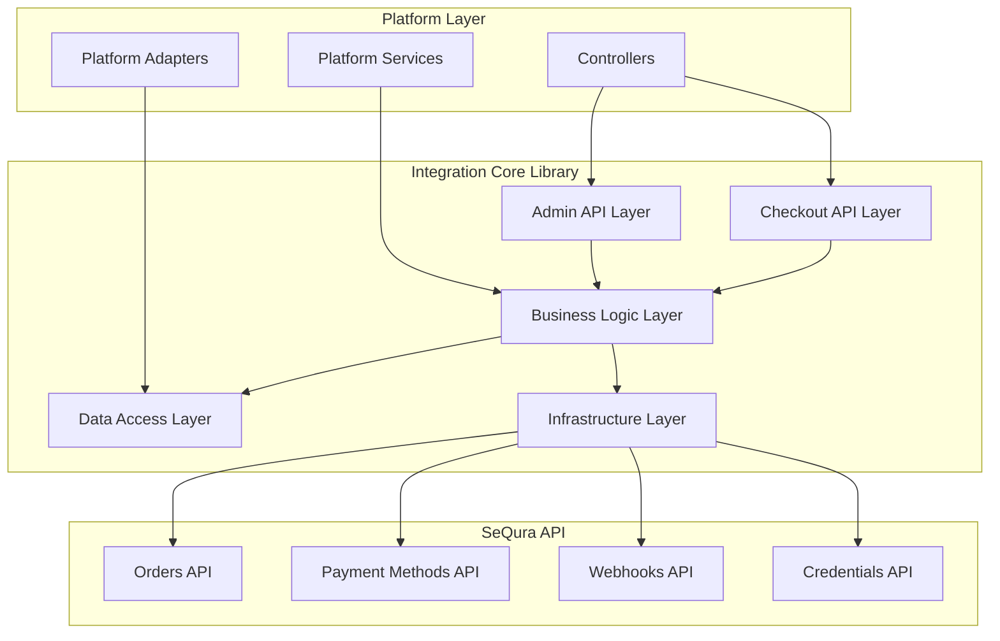
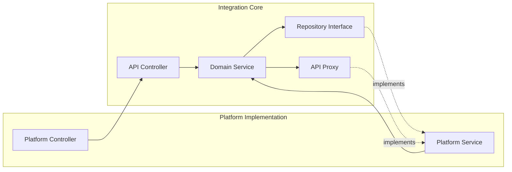

# SeQura Integration Core Library

## Table of Contents

1. [Overview](#overview)
2. [Architecture](#architecture)
3. [Installation and Setup](#installation-and-setup)
4. [Core Components](#core-components)
5. [Business Logic Layer](#business-logic-layer)
6. [API Communication](#api-communication)
7. [Service Registration](#service-registration)
8. [Usage Examples](#usage-examples)
9. [Integration Patterns](#integration-patterns)
10. [Troubleshooting](#troubleshooting)

## Overview

### What is the SeQura Integration Core?

The `sequra/integration-core` library is a platform-agnostic PHP library that provides the foundational business logic and API communication layer for integrating SeQura payment methods into any e-commerce platform. It follows clean architecture principles and provides a consistent interface for payment processing regardless of the underlying platform.

The library is designed to be:
- **Platform-agnostic**: Works with any PHP-based e-commerce platform
- **Modular**: Components can be used independently or together
- **Extensible**: Allows custom implementations of interfaces
- **Testable**: Clear separation of concerns with dependency injection

### Problems Solved by Integration Core

The integration-core library solves several key challenges:

1. **Payment Method Management**: Centralized logic for handling various SeQura payment options
2. **Order Lifecycle Management**: Standardized order processing across platforms
3. **API Abstraction**: Simplified interface for SeQura API communication
4. **Data Persistence**: Flexible data access layer with repository pattern
5. **Configuration Management**: Centralized settings and credentials handling
6. **Webhook Processing**: Standardized webhook handling and validation
7. **Error Handling**: Consistent error management and logging

## Architecture

### Integration Core Architecture

The `sequra/integration-core` library follows a layered architecture pattern that separates concerns and provides clear interfaces for platform integration:



### Core Library Structure

```
SeQura\Core\
├── BusinessLogic/
│   ├── AdminAPI/           # Admin panel management
│   ├── CheckoutAPI/        # Checkout process handling
│   ├── DataAccess/         # Repository interfaces and entities
│   ├── Domain/             # Core domain services
│   ├── Providers/          # Service providers
│   ├── SeQuraAPI/          # API client implementations
│   ├── TransactionLog/     # Transaction logging
│   ├── Utility/            # Helper utilities
│   ├── Webhook/            # Webhook processing
│   └── WebhookAPI/         # Webhook API handling
└── Infrastructure/
    ├── Configuration/      # Configuration management
    ├── Http/               # HTTP client abstractions
    ├── Logger/             # Logging interfaces
    ├── ORM/                # Data persistence abstractions
    └── ServiceRegister/    # Dependency injection container
```

### Component Interaction Pattern



## Installation and Setup

### Installing the Integration Core

The integration-core library is typically installed as a dependency of platform-specific modules:

```bash
composer require sequra/integration-core
```

### Basic Initialization

The library requires initialization before use. Here's how it's typically done (example from Magento 2 implementation):

```php
use SeQura\Core\BusinessLogic\BootstrapComponent;

// Initialize the core library
BootstrapComponent::init();
```

### Service Registration

The core library uses a service registry pattern for dependency injection. Services must be registered before use:

```php
use SeQura\Core\Infrastructure\ServiceRegister;
use SeQura\Core\BusinessLogic\Domain\Connection\Services\ConnectionService;

// Register required services
ServiceRegister::registerService(
    ConnectionService::class,
    static function () {
        return new ConnectionService(
            ServiceRegister::getService(ConnectionDataRepositoryInterface::class)
        );
    }
);
```

### Platform-Specific Implementations

Platforms need to provide implementations for core interfaces. Example from Magento 2:

```php
// Register Magento-specific repository implementation
ServiceRegister::registerService(
    ConnectionDataRepositoryInterface::class,
    function () {
        return new MagentoConnectionDataRepository();
    }
);

// Register Magento-specific logger
ServiceRegister::registerService(
    LoggerInterface::class,
    function () {
        return ObjectManager::getInstance()->get(LoggerInterface::class);
    }
);
```

## Core Components

### Bootstrap Component

The `BootstrapComponent` is the entry point for initializing the integration-core library. It registers all core services and establishes the service container:

```php
namespace SeQura\Core\BusinessLogic;

class BootstrapComponent
{
    /**
     * Initializes the integration core library
     */
    public static function init(): void
    {
        // Register repositories
        self::registerRepositories();
        
        // Register domain services
        self::registerDomainServices();
        
        // Register API proxies
        self::registerApiProxies();
        
        // Register controllers
        self::registerControllers();
    }
    
    private static function registerRepositories(): void
    {
        ServiceRegister::registerService(
            ConnectionDataRepositoryInterface::class,
            static function () {
                return new ConnectionDataRepository();
            }
        );
        
        ServiceRegister::registerService(
            PaymentMethodRepositoryInterface::class,
            static function () {
                return new PaymentMethodRepository();
            }
        );
        
        // ... other repositories
    }
}
```

### Service Register

The `ServiceRegister` provides a simple dependency injection container:

```php
namespace SeQura\Core\Infrastructure;

class ServiceRegister
{
    private static $services = [];
    
    /**
     * Register a service implementation
     */
    public static function registerService(string $interface, callable $factory): void
    {
        self::$services[$interface] = $factory;
    }
    
    /**
     * Get a service instance
     */
    public static function getService(string $interface)
    {
        if (!isset(self::$services[$interface])) {
            throw new ServiceNotRegisteredException($interface);
        }
        
        return self::$services[$interface]();
    }
}
```

Usage example from Magento 2 implementation:

```php
// In Magento's bootstrap process
ServiceRegister::registerService(
    LoggerInterface::class,
    function () {
        return ObjectManager::getInstance()->get(\Psr\Log\LoggerInterface::class);
    }
);

// Later, in core library code
$logger = ServiceRegister::getService(LoggerInterface::class);
$logger->info('Order processed successfully');
```

## Business Logic Layer

### Domain Services

The core library provides several domain services that encapsulate business logic:

#### Connection Service

Manages API credentials and connection validation:

```php
namespace SeQura\Core\BusinessLogic\Domain\Connection\Services;

class ConnectionService
{
    private $connectionDataRepository;
    private $credentialsRepository;
    
    public function __construct(
        ConnectionDataRepositoryInterface $connectionDataRepository,
        CredentialsRepositoryInterface $credentialsRepository
    ) {
        $this->connectionDataRepository = $connectionDataRepository;
        $this->credentialsRepository = $credentialsRepository;
    }
    
    /**
     * Test connection to SeQura API
     */
    public function testConnection(string $username, string $password): bool
    {
        try {
            $proxy = ServiceRegister::getService(ConnectionProxyInterface::class);
            return $proxy->testConnection($username, $password);
        } catch (Exception $e) {
            return false;
        }
    }
    
    /**
     * Save connection credentials
     */
    public function saveCredentials(string $username, string $password, string $environment): void
    {
        $credentials = new Credentials($username, $password, $environment);
        $this->credentialsRepository->save($credentials);
    }
}
```

Usage in platform implementation (Magento 2 example):

```php
// In Magento controller
class TestConnectionController extends Action
{
    public function execute()
    {
        $connectionService = ServiceRegister::getService(ConnectionService::class);
        
        $result = $connectionService->testConnection(
            $this->getRequest()->getParam('username'),
            $this->getRequest()->getParam('password')
        );
        
        return $this->resultJsonFactory->create()->setData(['success' => $result]);
    }
}
```

#### Payment Methods Service

Handles available payment options:

```php
namespace SeQura\Core\BusinessLogic\Domain\PaymentMethod\Services;

class PaymentMethodsService
{
    private $paymentMethodRepository;
    
    /**
     * Get available payment methods for given amount and country
     */
    public function getAvailablePaymentMethods(
        int $amount, 
        string $currency, 
        string $countryCode
    ): array {
        // Check cache first
        $cacheKey = $this->generateCacheKey($amount, $currency, $countryCode);
        $cached = $this->paymentMethodRepository->getCached($cacheKey);
        
        if ($cached) {
            return $cached;
        }
        
        // Fetch from API
        $proxy = ServiceRegister::getService(PaymentMethodsProxyInterface::class);
        $methods = $proxy->getPaymentMethods($amount, $currency, $countryCode);
        
        // Cache results
        $this->paymentMethodRepository->cache($cacheKey, $methods, 300); // 5 minutes
        
        return $methods;
    }
}
```

Platform usage example:

```php
// In Magento's ConfigProvider
class ConfigProvider implements ConfigProviderInterface
{
    public function getConfig()
    {
        $paymentMethodsService = ServiceRegister::getService(PaymentMethodsService::class);
        
        $quote = $this->checkoutSession->getQuote();
        $amount = (int)($quote->getGrandTotal() * 100); // Convert to cents
        
        $methods = $paymentMethodsService->getAvailablePaymentMethods(
            $amount,
            $quote->getQuoteCurrencyCode(),
            $quote->getBillingAddress()->getCountryId()
        );
        
        return [
            'payment' => [
                'sequra_payment' => [
                    'available_methods' => $methods
                ]
            ]
        ];
    }
}
```

#### Order Service

Manages order lifecycle:

```php
namespace SeQura\Core\BusinessLogic\Domain\Order\Services;

class OrderService
{
    /**
     * Create order in SeQura
     */
    public function createOrder(Order $order): OrderResponse
    {
        $proxy = ServiceRegister::getService(OrderProxyInterface::class);
        
        try {
            $response = $proxy->createOrder($order);
            
            // Log successful transaction
            $this->logTransaction($order, $response, 'create', true);
            
            return $response;
        } catch (Exception $e) {
            // Log failed transaction
            $this->logTransaction($order, null, 'create', false, $e->getMessage());
            throw $e;
        }
    }
    
    /**
     * Update order status
     */
    public function updateOrderStatus(string $orderId, string $status): void
    {
        $proxy = ServiceRegister::getService(OrderProxyInterface::class);
        
        $updateData = new OrderUpdateRequest([
            'order_id' => $orderId,
            'status' => $status,
            'updated_at' => date('c')
        ]);
        
        $proxy->updateOrder($updateData);
    }
    
    private function logTransaction(
        Order $order, 
        ?OrderResponse $response, 
        string $action, 
        bool $success, 
        ?string $errorMessage = null
    ): void {
        $log = new TransactionLog([
            'order_id' => $order->getId(),
            'action' => $action,
            'success' => $success,
            'request_data' => $order->toArray(),
            'response_data' => $response ? $response->toArray() : null,
            'error_message' => $errorMessage,
            'created_at' => date('c')
        ]);
        
        $repository = ServiceRegister::getService(TransactionLogRepositoryInterface::class);
        $repository->save($log);
    }
}
```

### Admin API Controllers

The library provides API controllers for admin panel integration:

#### General Settings Controller

```php
namespace SeQura\Core\BusinessLogic\AdminAPI\GeneralSettings;

class GeneralSettingsController
{
    /**
     * Get general settings
     */
    public function getGeneralSettings(): GeneralSettingsResponse
    {
        $service = ServiceRegister::getService(GeneralSettingsService::class);
        $settings = $service->getGeneralSettings();
        
        return new GeneralSettingsResponse($settings);
    }
    
    /**
     * Save general settings
     */
    public function saveGeneralSettings(GeneralSettingsRequest $request): void
    {
        $service = ServiceRegister::getService(GeneralSettingsService::class);
        $service->saveGeneralSettings($request->toSettings());
    }
}
```

Platform integration example:

```php
// Magento admin controller
class GeneralSettingsController extends Action
{
    public function execute()
    {
        $controller = ServiceRegister::getService(
            \SeQura\Core\BusinessLogic\AdminAPI\GeneralSettings\GeneralSettingsController::class
        );
        
        if ($this->getRequest()->isPost()) {
            $data = $this->getRequest()->getPostValue();
            $request = new GeneralSettingsRequest($data);
            
            try {
                $controller->saveGeneralSettings($request);
                $this->messageManager->addSuccessMessage('Settings saved successfully');
            } catch (Exception $e) {
                $this->messageManager->addErrorMessage('Error: ' . $e->getMessage());
            }
        }
        
        $response = $controller->getGeneralSettings();
        
        return $this->resultPageFactory->create();
    }
}
```

### Checkout API Controllers

#### Solicitation Controller

Handles payment solicitation process:

```php
namespace SeQura\Core\BusinessLogic\CheckoutAPI\Solicitation\Controller;

class SolicitationController
{
    /**
     * Create payment solicitation
     */
    public function createSolicitation(SolicitationRequest $request): SolicitationResponse
    {
        $orderService = ServiceRegister::getService(OrderService::class);
        
        // Convert request to order entity
        $order = $this->convertRequestToOrder($request);
        
        // Create order in SeQura
        $response = $orderService->createOrder($order);
        
        return new SolicitationResponse([
            'solicitation_id' => $response->getOrderId(),
            'redirect_url' => $response->getRedirectUrl(),
            'status' => $response->getStatus()
        ]);
    }
    
    private function convertRequestToOrder(SolicitationRequest $request): Order
    {
        return new Order([
            'merchant_reference' => $request->getMerchantReference(),
            'total_amount' => $request->getTotalAmount(),
            'currency' => $request->getCurrency(),
            'items' => $request->getItems(),
            'delivery_address' => $request->getDeliveryAddress(),
            'invoice_address' => $request->getInvoiceAddress(),
            'customer' => $request->getCustomer()
        ]);
    }
}
```

## API Communication

### Proxy Pattern for API Calls

The integration-core library uses the Proxy pattern to abstract API communication. This allows for easy testing and platform-specific HTTP client implementations:

#### Connection Proxy Interface

```php
namespace SeQura\Core\BusinessLogic\Domain\Connection\ProxyContracts;

interface ConnectionProxyInterface
{
    /**
     * Test connection to SeQura API
     */
    public function testConnection(string $username, string $password): bool;
    
    /**
     * Get merchant credentials
     */
    public function getMerchantCredentials(string $username, string $password): array;
}
```

#### Order Proxy Interface

```php
namespace SeQura\Core\BusinessLogic\Domain\Order\ProxyContracts;

interface OrderProxyInterface
{
    /**
     * Create order in SeQura
     */
    public function createOrder(Order $order): OrderResponse;
    
    /**
     * Update order status
     */
    public function updateOrder(OrderUpdateRequest $request): void;
    
    /**
     * Get order details
     */
    public function getOrder(string $orderId): OrderResponse;
}
```

#### Platform Implementation Example

Here's how Magento 2 implements the Order Proxy:

```php
// In Magento module
namespace Sequra\Core\Gateway\Http\Client;

use SeQura\Core\BusinessLogic\Domain\Order\ProxyContracts\OrderProxyInterface;

class OrderProxy implements OrderProxyInterface
{
    private $httpClientFactory;
    private $configProvider;
    
    public function createOrder(Order $order): OrderResponse
    {
        $client = $this->httpClientFactory->create();
        
        $requestData = [
            'merchant' => [
                'id' => $this->configProvider->getMerchantId()
            ],
            'cart' => [
                'order_total_with_tax' => $order->getTotalAmount(),
                'currency' => $order->getCurrency(),
                'items' => $this->buildCartItems($order->getItems())
            ],
            'delivery_address' => $this->buildAddress($order->getDeliveryAddress()),
            'invoice_address' => $this->buildAddress($order->getInvoiceAddress()),
            'customer' => $this->buildCustomer($order->getCustomer())
        ];
        
        $response = $client->request(
            'POST',
            $this->configProvider->getApiUrl() . '/orders',
            [
                'headers' => $this->getAuthHeaders(),
                'json' => $requestData
            ]
        );
        
        $responseData = json_decode($response->getBody()->getContents(), true);
        
        return new OrderResponse($responseData);
    }
    
    private function getAuthHeaders(): array
    {
        $credentials = base64_encode(
            $this->configProvider->getUsername() . ':' . $this->configProvider->getPassword()
        );
        
        return [
            'Authorization' => 'Basic ' . $credentials,
            'Content-Type' => 'application/json',
            'User-Agent' => 'SeQura-Magento2/' . $this->configProvider->getModuleVersion()
        ];
    }
}
```

### Request/Response Objects

The library defines structured request and response objects:

#### Order Response

```php
namespace SeQura\Core\BusinessLogic\Domain\Order\Models;

class OrderResponse
{
    private $orderId;
    private $status;
    private $redirectUrl;
    private $paymentMethods;
    
    public function __construct(array $data)
    {
        $this->orderId = $data['order']['id'] ?? null;
        $this->status = $data['order']['status'] ?? null;
        $this->redirectUrl = $data['order']['redirect_url'] ?? null;
        $this->paymentMethods = $data['order']['payment_methods'] ?? [];
    }
    
    public function getOrderId(): ?string
    {
        return $this->orderId;
    }
    
    public function getStatus(): ?string
    {
        return $this->status;
    }
    
    public function getRedirectUrl(): ?string
    {
        return $this->redirectUrl;
    }
    
    public function getPaymentMethods(): array
    {
        return $this->paymentMethods;
    }
    
    public function isSuccessful(): bool
    {
        return !empty($this->orderId) && !empty($this->status);
    }
}
```

#### Payment Methods Response

```php
namespace SeQura\Core\BusinessLogic\Domain\PaymentMethod\Models;

class PaymentMethodsResponse
{
    private $methods;
    
    public function __construct(array $data)
    {
        $this->methods = array_map(
            function ($method) {
                return new PaymentMethod($method);
            },
            $data['payment_methods'] ?? []
        );
    }
    
    public function getMethods(): array
    {
        return $this->methods;
    }
    
    public function hasAvailableMethods(): bool
    {
        return count($this->methods) > 0;
    }
}

class PaymentMethod
{
    private $code;
    private $title;
    private $description;
    private $logoUrl;
    
    public function __construct(array $data)
    {
        $this->code = $data['code'] ?? '';
        $this->title = $data['title'] ?? '';
        $this->description = $data['description'] ?? '';
        $this->logoUrl = $data['logo_url'] ?? '';
    }
    
    // Getters...
}
```

### Error Handling and Validation

The library provides consistent error handling:

#### API Exception Handling

```php
namespace SeQura\Core\BusinessLogic\Domain\Order\Services;

class OrderService
{
    public function createOrder(Order $order): OrderResponse
    {
        try {
            // Validate order before sending
            $this->validateOrder($order);
            
            $proxy = ServiceRegister::getService(OrderProxyInterface::class);
            $response = $proxy->createOrder($order);
            
            // Validate response
            $this->validateResponse($response);
            
            return $response;
            
        } catch (ValidationException $e) {
            $this->logError('Order validation failed', $e, $order);
            throw new OrderCreationException('Invalid order data: ' . $e->getMessage());
            
        } catch (ApiException $e) {
            $this->logError('API request failed', $e, $order);
            throw new OrderCreationException('SeQura API error: ' . $e->getMessage());
            
        } catch (Exception $e) {
            $this->logError('Unexpected error', $e, $order);
            throw new OrderCreationException('Unexpected error occurred');
        }
    }
    
    private function validateOrder(Order $order): void
    {
        $validator = ServiceRegister::getService(OrderValidator::class);
        
        if (!$validator->isValid($order)) {
            throw new ValidationException(
                'Order validation failed: ' . implode(', ', $validator->getErrors())
            );
        }
    }
    
    private function validateResponse(OrderResponse $response): void
    {
        if (!$response->isSuccessful()) {
            throw new ApiException('Invalid response from SeQura API');
        }
    }
    
    private function logError(string $message, Exception $e, Order $order): void
    {
        $logger = ServiceRegister::getService(LoggerInterface::class);
        $logger->error($message, [
            'exception' => $e->getMessage(),
            'order_id' => $order->getId(),
            'trace' => $e->getTraceAsString()
        ]);
    }
}
```

### Webhook Processing

The library provides a standardized webhook processing system:

#### Webhook Controller

```php
namespace SeQura\Core\BusinessLogic\WebhookAPI\Controller;

class WebhookController
{
    /**
     * Process incoming webhook
     */
    public function processWebhook(array $webhookData): WebhookResponse
    {
        try {
            // Validate webhook signature
            $this->validateWebhookSignature($webhookData);
            
            // Parse webhook data
            $webhook = new Webhook($webhookData);
            
            // Process based on webhook type
            $processor = $this->getProcessor($webhook->getType());
            $result = $processor->process($webhook);
            
            // Log successful processing
            $this->logWebhook($webhook, true);
            
            return new WebhookResponse(['status' => 'success', 'result' => $result]);
            
        } catch (InvalidWebhookException $e) {
            $this->logWebhook($webhook ?? null, false, $e->getMessage());
            return new WebhookResponse(['status' => 'error', 'message' => 'Invalid webhook'], 400);
            
        } catch (Exception $e) {
            $this->logWebhook($webhook ?? null, false, $e->getMessage());
            return new WebhookResponse(['status' => 'error', 'message' => 'Processing failed'], 500);
        }
    }
    
    private function getProcessor(string $webhookType): WebhookProcessorInterface
    {
        $processors = [
            'order.approved' => OrderApprovedProcessor::class,
            'order.cancelled' => OrderCancelledProcessor::class,
            'order.delivered' => OrderDeliveredProcessor::class,
        ];
        
        if (!isset($processors[$webhookType])) {
            throw new InvalidWebhookException('Unknown webhook type: ' . $webhookType);
        }
        
        return ServiceRegister::getService($processors[$webhookType]);
    }
}
```

Platform usage example:

```php
// Magento webhook endpoint
class WebhookController extends Action
{
    public function execute()
    {
        $payload = $this->getRequest()->getContent();
        $webhookData = json_decode($payload, true);
        
        $controller = ServiceRegister::getService(
            \SeQura\Core\BusinessLogic\WebhookAPI\Controller\WebhookController::class
        );
        
        $response = $controller->processWebhook($webhookData);
        
        return $this->resultJsonFactory->create()
            ->setData($response->getData())
            ->setHttpResponseCode($response->getStatusCode());
    }
}
```

## Service Registration

### Dependency Injection Container

The integration-core library includes a simple but powerful dependency injection container through the `ServiceRegister` class. This allows for flexible service registration and easy testing.

#### Basic Service Registration

```php
use SeQura\Core\Infrastructure\ServiceRegister;

// Register a service with a factory function
ServiceRegister::registerService(
    MyServiceInterface::class,
    function () {
        return new MyServiceImplementation();
    }
);

// Register a service with dependencies
ServiceRegister::registerService(
    OrderService::class,
    function () {
        return new OrderService(
            ServiceRegister::getService(OrderRepositoryInterface::class),
            ServiceRegister::getService(LoggerInterface::class)
        );
    }
);
```

#### Service Registration in Platform Integration

Example from Magento 2 implementation showing how to register platform-specific services:

```php
// In Magento's bootstrap or DI configuration
class SequraServiceRegistration
{
    public function registerServices(): void
    {
        // Register Magento-specific logger
        ServiceRegister::registerService(
            LoggerInterface::class,
            function () {
                return ObjectManager::getInstance()->get(\Psr\Log\LoggerInterface::class);
            }
        );
        
        // Register Magento-specific HTTP client
        ServiceRegister::registerService(
            HttpClientInterface::class,
            function () {
                return new MagentoHttpClient(
                    ObjectManager::getInstance()->get(\Magento\Framework\HTTP\Client\Curl::class)
                );
            }
        );
        
        // Register Magento-specific configuration provider
        ServiceRegister::registerService(
            ConfigurationServiceInterface::class,
            function () {
                return new MagentoConfigurationService(
                    ObjectManager::getInstance()->get(\Magento\Framework\App\Config\ScopeConfigInterface::class)
                );
            }
        );
        
        // Register repositories with Magento's resource model
        ServiceRegister::registerService(
            ConnectionDataRepositoryInterface::class,
            function () {
                return new MagentoConnectionDataRepository(
                    ObjectManager::getInstance()->get(\Magento\Framework\App\ResourceConnection::class)
                );
            }
        );
    }
}
```

#### Service Singleton Pattern

The ServiceRegister implements a singleton pattern for services:

```php
class ServiceRegister
{
    private static $services = [];
    private static $instances = [];
    
    public static function getService(string $interface)
    {
        // Return existing instance if available
        if (isset(self::$instances[$interface])) {
            return self::$instances[$interface];
        }
        
        // Create new instance and cache it
        if (!isset(self::$services[$interface])) {
            throw new ServiceNotRegisteredException($interface);
        }
        
        $instance = self::$services[$interface]();
        self::$instances[$interface] = $instance;
        
        return $instance;
    }
}
```

### Required Service Interfaces

Platforms integrating the core library must provide implementations for these key interfaces:

#### Logger Interface

```php
namespace SeQura\Core\Infrastructure\Logger;

interface LoggerInterface
{
    /**
     * Log info message
     */
    public function info(string $message, array $context = []): void;
    
    /**
     * Log error message
     */
    public function error(string $message, array $context = []): void;
    
    /**
     * Log warning message
     */
    public function warning(string $message, array $context = []): void;
    
    /**
     * Log debug message
     */
    public function debug(string $message, array $context = []): void;
}
```

Magento implementation example:

```php
class MagentoLogger implements LoggerInterface
{
    private $logger;
    
    public function __construct(\Psr\Log\LoggerInterface $logger)
    {
        $this->logger = $logger;
    }
    
    public function info(string $message, array $context = []): void
    {
        $this->logger->info('[SeQura] ' . $message, $context);
    }
    
    public function error(string $message, array $context = []): void
    {
        $this->logger->error('[SeQura] ' . $message, $context);
    }
}
```

#### Configuration Service Interface

```php
namespace SeQura\Core\Infrastructure\Configuration;

interface ConfigurationServiceInterface
{
    /**
     * Get configuration value
     */
    public function get(string $key, $default = null);
    
    /**
     * Set configuration value
     */
    public function set(string $key, $value): void;
    
    /**
     * Check if configuration key exists
     */
    public function has(string $key): bool;
}
```

#### HTTP Client Interface

```php
namespace SeQura\Core\Infrastructure\Http;

interface HttpClientInterface
{
    /**
     * Send GET request
     */
    public function get(string $url, array $headers = []): HttpResponse;
    
    /**
     * Send POST request
     */
    public function post(string $url, array $data = [], array $headers = []): HttpResponse;
    
    /**
     * Send PUT request
     */
    public function put(string $url, array $data = [], array $headers = []): HttpResponse;
}
```

## Usage Examples

### Complete Integration Example

Here's a comprehensive example showing how to integrate the SeQura core library into a platform:

#### 1. Bootstrap and Service Registration

```php
<?php
// Platform-specific bootstrap file

use SeQura\Core\BusinessLogic\BootstrapComponent;
use SeQura\Core\Infrastructure\ServiceRegister;

class SeQuraIntegration
{
    public function initialize(): void
    {
        // Initialize the core library
        BootstrapComponent::init();
        
        // Register platform-specific implementations
        $this->registerPlatformServices();
    }
    
    private function registerPlatformServices(): void
    {
        // Register logger
        ServiceRegister::registerService(
            LoggerInterface::class,
            function () {
                return new PlatformLogger();
            }
        );
        
        // Register HTTP client
        ServiceRegister::registerService(
            HttpClientInterface::class,
            function () {
                return new PlatformHttpClient();
            }
        );
        
        // Register configuration service
        ServiceRegister::registerService(
            ConfigurationServiceInterface::class,
            function () {
                return new PlatformConfigurationService();
            }
        );
        
        // Register repositories
        $this->registerRepositories();
        
        // Register API proxies
        $this->registerApiProxies();
    }
    
    private function registerRepositories(): void
    {
        ServiceRegister::registerService(
            ConnectionDataRepositoryInterface::class,
            function () {
                return new PlatformConnectionDataRepository();
            }
        );
        
        ServiceRegister::registerService(
            TransactionLogRepositoryInterface::class,
            function () {
                return new PlatformTransactionLogRepository();
            }
        );
    }
    
    private function registerApiProxies(): void
    {
        ServiceRegister::registerService(
            ConnectionProxyInterface::class,
            function () {
                return new PlatformConnectionProxy(
                    ServiceRegister::getService(HttpClientInterface::class),
                    ServiceRegister::getService(ConfigurationServiceInterface::class)
                );
            }
        );
        
        ServiceRegister::registerService(
            OrderProxyInterface::class,
            function () {
                return new PlatformOrderProxy(
                    ServiceRegister::getService(HttpClientInterface::class),
                    ServiceRegister::getService(ConfigurationServiceInterface::class)
                );
            }
        );
    }
}
```

#### 2. Platform-Specific Repository Implementation

```php
<?php
// Example repository implementation for database persistence

use SeQura\Core\BusinessLogic\DataAccess\ConnectionData\Entities\ConnectionData;
use SeQura\Core\BusinessLogic\DataAccess\ConnectionData\Repositories\ConnectionDataRepositoryInterface;

class PlatformConnectionDataRepository implements ConnectionDataRepositoryInterface
{
    private $database;
    
    public function __construct(DatabaseInterface $database)
    {
        $this->database = $database;
    }
    
    public function save(ConnectionData $connectionData): void
    {
        $data = [
            'merchant_id' => $connectionData->getMerchantId(),
            'environment' => $connectionData->getEnvironment(),
            'created_at' => $connectionData->getCreatedAt(),
            'updated_at' => date('Y-m-d H:i:s')
        ];
        
        if ($this->exists($connectionData->getMerchantId())) {
            $this->database->update('sequra_connection_data', $data, [
                'merchant_id' => $connectionData->getMerchantId()
            ]);
        } else {
            $this->database->insert('sequra_connection_data', $data);
        }
    }
    
    public function find(string $merchantId): ?ConnectionData
    {
        $row = $this->database->selectOne(
            'SELECT * FROM sequra_connection_data WHERE merchant_id = ?',
            [$merchantId]
        );
        
        return $row ? new ConnectionData($row) : null;
    }
    
    public function exists(string $merchantId): bool
    {
        return $this->find($merchantId) !== null;
    }
    
    public function delete(string $merchantId): void
    {
        $this->database->delete('sequra_connection_data', [
            'merchant_id' => $merchantId
        ]);
    }
}
```

#### 3. API Proxy Implementation

```php
<?php
// Platform-specific API proxy implementation

use SeQura\Core\BusinessLogic\Domain\Order\ProxyContracts\OrderProxyInterface;
use SeQura\Core\BusinessLogic\Domain\Order\Models\Order;
use SeQura\Core\BusinessLogic\Domain\Order\Models\OrderResponse;

class PlatformOrderProxy implements OrderProxyInterface
{
    private $httpClient;
    private $configService;
    private $logger;
    
    public function __construct(
        HttpClientInterface $httpClient,
        ConfigurationServiceInterface $configService
    ) {
        $this->httpClient = $httpClient;
        $this->configService = $configService;
        $this->logger = ServiceRegister::getService(LoggerInterface::class);
    }
    
    public function createOrder(Order $order): OrderResponse
    {
        $url = $this->getApiUrl() . '/orders';
        
        $requestData = [
            'merchant' => [
                'id' => $this->configService->get('sequra.merchant_id')
            ],
            'cart' => [
                'order_total_with_tax' => $order->getTotalAmount(),
                'currency' => $order->getCurrency(),
                'items' => $this->buildCartItems($order->getItems())
            ],
            'delivery_address' => $this->buildAddress($order->getDeliveryAddress()),
            'invoice_address' => $this->buildAddress($order->getInvoiceAddress()),
            'customer' => $this->buildCustomer($order->getCustomer())
        ];
        
        $this->logger->info('Creating SeQura order', [
            'merchant_reference' => $order->getMerchantReference(),
            'amount' => $order->getTotalAmount()
        ]);
        
        try {
            $response = $this->httpClient->post($url, $requestData, $this->getAuthHeaders());
            
            $responseData = json_decode($response->getBody(), true);
            
            $this->logger->info('SeQura order created successfully', [
                'order_id' => $responseData['order']['id'] ?? 'unknown',
                'status' => $responseData['order']['status'] ?? 'unknown'
            ]);
            
            return new OrderResponse($responseData);
            
        } catch (Exception $e) {
            $this->logger->error('Failed to create SeQura order', [
                'error' => $e->getMessage(),
                'merchant_reference' => $order->getMerchantReference()
            ]);
            
            throw new ApiException('Order creation failed: ' . $e->getMessage());
        }
    }
    
    private function getApiUrl(): string
    {
        $environment = $this->configService->get('sequra.environment', 'sandbox');
        
        return $environment === 'production' 
            ? 'https://api.sequra.com' 
            : 'https://sandbox.api.sequra.com';
    }
    
    private function getAuthHeaders(): array
    {
        $username = $this->configService->get('sequra.username');
        $password = $this->configService->get('sequra.password');
        
        $credentials = base64_encode($username . ':' . $password);
        
        return [
            'Authorization' => 'Basic ' . $credentials,
            'Content-Type' => 'application/json',
            'User-Agent' => 'SeQura-Platform/1.0'
        ];
    }
    
    private function buildCartItems(array $items): array
    {
        return array_map(function ($item) {
            return [
                'reference' => $item['sku'],
                'name' => $item['name'],
                'price_with_tax' => (int)($item['price'] * 100), // Convert to cents
                'quantity' => $item['quantity'],
                'downloadable' => $item['is_virtual'] ?? false
            ];
        }, $items);
    }
    
    private function buildAddress(array $address): array
    {
        return [
            'given_names' => $address['firstname'],
            'surnames' => $address['lastname'],
            'company' => $address['company'] ?? '',
            'address_line_1' => $address['street'][0] ?? '',
            'address_line_2' => $address['street'][1] ?? '',
            'postal_code' => $address['postcode'],
            'city' => $address['city'],
            'country_code' => $address['country_id'],
            'phone' => $address['telephone'] ?? ''
        ];
    }
}
```

#### 4. Using Core Services in Platform Controllers

```php
<?php
// Platform controller using core library services

use SeQura\Core\BusinessLogic\AdminAPI\GeneralSettings\GeneralSettingsController;
use SeQura\Core\BusinessLogic\CheckoutAPI\PaymentMethods\CachedPaymentMethodsController;

class PlatformSeQuraController
{
    /**
     * Admin endpoint to save general settings
     */
    public function saveGeneralSettings(): array
    {
        try {
            $controller = ServiceRegister::getService(GeneralSettingsController::class);
            
            $request = new GeneralSettingsRequest([
                'send_order_reports' => $_POST['send_order_reports'] ?? false,
                'show_on_product_page' => $_POST['show_on_product_page'] ?? false,
                'show_on_checkout_page' => $_POST['show_on_checkout_page'] ?? false
            ]);
            
            $controller->saveGeneralSettings($request);
            
            return ['success' => true, 'message' => 'Settings saved successfully'];
            
        } catch (Exception $e) {
            return ['success' => false, 'message' => $e->getMessage()];
        }
    }
    
    /**
     * Get available payment methods for checkout
     */
    public function getPaymentMethods(): array
    {
        try {
            $controller = ServiceRegister::getService(CachedPaymentMethodsController::class);
            
            $request = new PaymentMethodsRequest([
                'amount' => (int)($_POST['amount'] * 100), // Convert to cents
                'currency' => $_POST['currency'] ?? 'EUR',
                'country' => $_POST['country'] ?? 'ES'
            ]);
            
            $response = $controller->getPaymentMethods($request);
            
            return [
                'success' => true,
                'payment_methods' => $response->getPaymentMethods()
            ];
            
        } catch (Exception $e) {
            return ['success' => false, 'message' => $e->getMessage()];
        }
    }
    
    /**
     * Create payment solicitation
     */
    public function createSolicitation(): array
    {
        try {
            $controller = ServiceRegister::getService(SolicitationController::class);
            
            $request = new SolicitationRequest([
                'merchant_reference' => $_POST['order_id'],
                'total_amount' => (int)($_POST['total'] * 100),
                'currency' => $_POST['currency'],
                'items' => $_POST['items'],
                'delivery_address' => $_POST['delivery_address'],
                'invoice_address' => $_POST['invoice_address'],
                'customer' => $_POST['customer']
            ]);
            
            $response = $controller->createSolicitation($request);
            
            return [
                'success' => true,
                'solicitation_id' => $response->getSolicitationId(),
                'redirect_url' => $response->getRedirectUrl()
            ];
            
        } catch (Exception $e) {
            return ['success' => false, 'message' => $e->getMessage()];
        }
    }
}
```

#### 5. Webhook Handling

```php
<?php
// Platform webhook endpoint

use SeQura\Core\BusinessLogic\WebhookAPI\Controller\WebhookController;

class PlatformWebhookController
{
    public function handleWebhook(): void
    {
        try {
            // Get webhook payload
            $payload = file_get_contents('php://input');
            $webhookData = json_decode($payload, true);
            
            if (json_last_error() !== JSON_ERROR_NONE) {
                http_response_code(400);
                echo json_encode(['error' => 'Invalid JSON payload']);
                return;
            }
            
            // Process webhook using core library
            $controller = ServiceRegister::getService(WebhookController::class);
            $response = $controller->processWebhook($webhookData);
            
            // Send response
            http_response_code($response->getStatusCode());
            echo json_encode($response->getData());
            
        } catch (Exception $e) {
            // Log error
            $logger = ServiceRegister::getService(LoggerInterface::class);
            $logger->error('Webhook processing failed', [
                'error' => $e->getMessage(),
                'payload' => $payload ?? 'N/A'
            ]);
            
            http_response_code(500);
            echo json_encode(['error' => 'Internal server error']);
        }
    }
}
```

### Testing the Integration

#### Unit Testing Example

```php
<?php
// Example unit test for core library integration

use PHPUnit\Framework\TestCase;
use SeQura\Core\Infrastructure\ServiceRegister;
use SeQura\Core\BusinessLogic\Domain\Order\Services\OrderService;

class OrderServiceTest extends TestCase
{
    private $orderService;
    private $mockRepository;
    private $mockProxy;
    
    protected function setUp(): void
    {
        // Register mock services
        $this->mockRepository = $this->createMock(OrderRepositoryInterface::class);
        $this->mockProxy = $this->createMock(OrderProxyInterface::class);
        
        ServiceRegister::registerService(
            OrderRepositoryInterface::class,
            function () {
                return $this->mockRepository;
            }
        );
        
        ServiceRegister::registerService(
            OrderProxyInterface::class,
            function () {
                return $this->mockProxy;
            }
        );
        
        $this->orderService = ServiceRegister::getService(OrderService::class);
    }
    
    public function testCreateOrderSuccess(): void
    {
        // Arrange
        $order = new Order([
            'merchant_reference' => 'TEST-001',
            'total_amount' => 10000, // €100.00
            'currency' => 'EUR'
        ]);
        
        $expectedResponse = new OrderResponse([
            'order' => [
                'id' => 'SQ123456',
                'status' => 'approved',
                'redirect_url' => 'https://sequra.com/redirect'
            ]
        ]);
        
        $this->mockProxy
            ->expects($this->once())
            ->method('createOrder')
            ->with($order)
            ->willReturn($expectedResponse);
        
        // Act
        $result = $this->orderService->createOrder($order);
        
        // Assert
        $this->assertEquals('SQ123456', $result->getOrderId());
        $this->assertEquals('approved', $result->getStatus());
    }
}
```

## Integration Patterns

### Repository Pattern Implementation

The integration-core library uses the Repository pattern for data persistence. This allows platforms to implement their own data storage mechanisms while maintaining a consistent interface.

#### Entity Definition

```php
namespace SeQura\Core\BusinessLogic\DataAccess\ConnectionData\Entities;

class ConnectionData
{
    private $merchantId;
    private $environment;
    private $createdAt;
    private $updatedAt;
    
    public function __construct(array $data = [])
    {
        $this->merchantId = $data['merchant_id'] ?? '';
        $this->environment = $data['environment'] ?? 'sandbox';
        $this->createdAt = $data['created_at'] ?? date('Y-m-d H:i:s');
        $this->updatedAt = $data['updated_at'] ?? date('Y-m-d H:i:s');
    }
    
    public function getMerchantId(): string
    {
        return $this->merchantId;
    }
    
    public function getEnvironment(): string
    {
        return $this->environment;
    }
    
    public function toArray(): array
    {
        return [
            'merchant_id' => $this->merchantId,
            'environment' => $this->environment,
            'created_at' => $this->createdAt,
            'updated_at' => $this->updatedAt
        ];
    }
}
```

#### Repository Interface

```php
namespace SeQura\Core\BusinessLogic\DataAccess\ConnectionData\Repositories;

interface ConnectionDataRepositoryInterface
{
    /**
     * Save connection data
     */
    public function save(ConnectionData $connectionData): void;
    
    /**
     * Find connection data by merchant ID
     */
    public function find(string $merchantId): ?ConnectionData;
    
    /**
     * Check if connection data exists
     */
    public function exists(string $merchantId): bool;
    
    /**
     * Delete connection data
     */
    public function delete(string $merchantId): void;
    
    /**
     * Get all connection data
     */
    public function getAll(): array;
}
```

#### Platform Implementation Examples

**Magento 2 Repository Implementation:**

```php
// Magento 2 implementation using resource models
class MagentoConnectionDataRepository implements ConnectionDataRepositoryInterface
{
    private $resourceConnection;
    private $tableName;
    
    public function __construct(ResourceConnection $resourceConnection)
    {
        $this->resourceConnection = $resourceConnection;
        $this->tableName = $resourceConnection->getTableName('sequra_connection_data');
    }
    
    public function save(ConnectionData $connectionData): void
    {
        $connection = $this->resourceConnection->getConnection();
        
        $data = $connectionData->toArray();
        $data['updated_at'] = date('Y-m-d H:i:s');
        
        if ($this->exists($connectionData->getMerchantId())) {
            $connection->update(
                $this->tableName,
                $data,
                ['merchant_id = ?' => $connectionData->getMerchantId()]
            );
        } else {
            $connection->insert($this->tableName, $data);
        }
    }
    
    public function find(string $merchantId): ?ConnectionData
    {
        $connection = $this->resourceConnection->getConnection();
        
        $select = $connection->select()
            ->from($this->tableName)
            ->where('merchant_id = ?', $merchantId);
        
        $row = $connection->fetchRow($select);
        
        return $row ? new ConnectionData($row) : null;
    }
}
```

**Generic PHP Repository Implementation:**

```php
// Generic PHP implementation using PDO
class PDOConnectionDataRepository implements ConnectionDataRepositoryInterface
{
    private $pdo;
    
    public function __construct(PDO $pdo)
    {
        $this->pdo = $pdo;
    }
    
    public function save(ConnectionData $connectionData): void
    {
        if ($this->exists($connectionData->getMerchantId())) {
            $sql = "UPDATE sequra_connection_data 
                    SET environment = ?, updated_at = ? 
                    WHERE merchant_id = ?";
            
            $stmt = $this->pdo->prepare($sql);
            $stmt->execute([
                $connectionData->getEnvironment(),
                date('Y-m-d H:i:s'),
                $connectionData->getMerchantId()
            ]);
        } else {
            $sql = "INSERT INTO sequra_connection_data 
                    (merchant_id, environment, created_at, updated_at) 
                    VALUES (?, ?, ?, ?)";
            
            $stmt = $this->pdo->prepare($sql);
            $stmt->execute([
                $connectionData->getMerchantId(),
                $connectionData->getEnvironment(),
                $connectionData->getCreatedAt(),
                date('Y-m-d H:i:s')
            ]);
        }
    }
    
    public function find(string $merchantId): ?ConnectionData
    {
        $sql = "SELECT * FROM sequra_connection_data WHERE merchant_id = ?";
        $stmt = $this->pdo->prepare($sql);
        $stmt->execute([$merchantId]);
        
        $row = $stmt->fetch(PDO::FETCH_ASSOC);
        
        return $row ? new ConnectionData($row) : null;
    }
}
```

### Controller Pattern

The library provides API controllers that can be used by platform-specific controllers:

#### Core API Controller

```php
namespace SeQura\Core\BusinessLogic\AdminAPI\PaymentMethods;

class PaymentMethodsController
{
    private $paymentMethodsService;
    
    public function __construct()
    {
        $this->paymentMethodsService = ServiceRegister::getService(PaymentMethodsService::class);
    }
    
    /**
     * Get available payment methods
     */
    public function getPaymentMethods(PaymentMethodsRequest $request): PaymentMethodsResponse
    {
        try {
            $methods = $this->paymentMethodsService->getAvailablePaymentMethods(
                $request->getAmount(),
                $request->getCurrency(),
                $request->getCountryCode()
            );
            
            return new PaymentMethodsResponse($methods);
            
        } catch (Exception $e) {
            throw new PaymentMethodsException('Failed to fetch payment methods: ' . $e->getMessage());
        }
    }
    
    /**
     * Cache payment methods for performance
     */
    public function cachePaymentMethods(PaymentMethodsRequest $request): void
    {
        $cacheKey = $this->generateCacheKey($request);
        
        $methods = $this->paymentMethodsService->getAvailablePaymentMethods(
            $request->getAmount(),
            $request->getCurrency(),
            $request->getCountryCode()
        );
        
        $this->paymentMethodsService->cacheResults($cacheKey, $methods);
    }
    
    private function generateCacheKey(PaymentMethodsRequest $request): string
    {
        return sprintf(
            'payment_methods_%s_%s_%s',
            $request->getAmount(),
            $request->getCurrency(),
            $request->getCountryCode()
        );
    }
}
```

#### Platform Controller Integration

```php
// Platform-specific controller using core controller
class PlatformPaymentMethodsController
{
    private $coreController;
    
    public function __construct()
    {
        $this->coreController = ServiceRegister::getService(PaymentMethodsController::class);
    }
    
    /**
     * REST API endpoint: GET /api/sequra/payment-methods
     */
    public function getPaymentMethods(): array
    {
        try {
            // Validate request parameters
            $amount = $this->validateAmount($_GET['amount'] ?? null);
            $currency = $this->validateCurrency($_GET['currency'] ?? 'EUR');
            $country = $this->validateCountry($_GET['country'] ?? 'ES');
            
            // Create core request object
            $request = new PaymentMethodsRequest([
                'amount' => $amount,
                'currency' => $currency,
                'country_code' => $country
            ]);
            
            // Use core controller
            $response = $this->coreController->getPaymentMethods($request);
            
            // Return platform-formatted response
            return [
                'success' => true,
                'data' => [
                    'payment_methods' => $response->getMethods(),
                    'cache_ttl' => 300
                ]
            ];
            
        } catch (ValidationException $e) {
            return [
                'success' => false,
                'error' => 'Validation error: ' . $e->getMessage(),
                'code' => 'VALIDATION_ERROR'
            ];
            
        } catch (PaymentMethodsException $e) {
            return [
                'success' => false,
                'error' => 'Payment methods error: ' . $e->getMessage(),
                'code' => 'PAYMENT_METHODS_ERROR'
            ];
            
        } catch (Exception $e) {
            return [
                'success' => false,
                'error' => 'Internal server error',
                'code' => 'INTERNAL_ERROR'
            ];
        }
    }
    
    private function validateAmount($amount): int
    {
        if (!is_numeric($amount) || $amount <= 0) {
            throw new ValidationException('Invalid amount');
        }
        
        return (int)($amount * 100); // Convert to cents
    }
    
    private function validateCurrency($currency): string
    {
        $allowedCurrencies = ['EUR', 'USD', 'GBP'];
        
        if (!in_array($currency, $allowedCurrencies)) {
            throw new ValidationException('Unsupported currency');
        }
        
        return $currency;
    }
}
```

### Event-Driven Architecture

The core library supports event-driven architecture through domain events:

#### Domain Events

```php
namespace SeQura\Core\BusinessLogic\Domain\Order\Events;

class OrderCreatedEvent
{
    private $orderId;
    private $merchantReference;
    private $totalAmount;
    private $timestamp;
    
    public function __construct(string $orderId, string $merchantReference, int $totalAmount)
    {
        $this->orderId = $orderId;
        $this->merchantReference = $merchantReference;
        $this->totalAmount = $totalAmount;
        $this->timestamp = date('c');
    }
    
    public function getOrderId(): string
    {
        return $this->orderId;
    }
    
    public function getMerchantReference(): string
    {
        return $this->merchantReference;
    }
    
    public function getTotalAmount(): int
    {
        return $this->totalAmount;
    }
    
    public function getTimestamp(): string
    {
        return $this->timestamp;
    }
}
```

#### Event Handler Interface

```php
namespace SeQura\Core\BusinessLogic\Domain\Order\Events;

interface OrderEventHandlerInterface
{
    /**
     * Handle order created event
     */
    public function handleOrderCreated(OrderCreatedEvent $event): void;
    
    /**
     * Handle order updated event
     */
    public function handleOrderUpdated(OrderUpdatedEvent $event): void;
    
    /**
     * Handle order cancelled event
     */
    public function handleOrderCancelled(OrderCancelledEvent $event): void;
}
```

#### Platform Event Handler Implementation

```php
// Platform-specific event handler
class PlatformOrderEventHandler implements OrderEventHandlerInterface
{
    private $logger;
    private $notificationService;
    
    public function __construct()
    {
        $this->logger = ServiceRegister::getService(LoggerInterface::class);
        $this->notificationService = new PlatformNotificationService();
    }
    
    public function handleOrderCreated(OrderCreatedEvent $event): void
    {
        $this->logger->info('SeQura order created', [
            'order_id' => $event->getOrderId(),
            'merchant_reference' => $event->getMerchantReference(),
            'amount' => $event->getTotalAmount()
        ]);
        
        // Send notification to admin
        $this->notificationService->sendAdminNotification(
            'New SeQura order created',
            sprintf(
                'Order %s has been created with amount %d cents',
                $event->getMerchantReference(),
                $event->getTotalAmount()
            )
        );
        
        // Update platform-specific order status
        $this->updatePlatformOrderStatus($event->getMerchantReference(), 'sequra_pending');
    }
    
    public function handleOrderUpdated(OrderUpdatedEvent $event): void
    {
        $this->logger->info('SeQura order updated', [
            'order_id' => $event->getOrderId(),
            'new_status' => $event->getNewStatus(),
            'previous_status' => $event->getPreviousStatus()
        ]);
        
        // Update platform order status based on SeQura status
        $platformStatus = $this->mapSeQuraStatusToPlatformStatus($event->getNewStatus());
        $this->updatePlatformOrderStatus($event->getMerchantReference(), $platformStatus);
    }
    
    private function mapSeQuraStatusToPlatformStatus(string $sequraStatus): string
    {
        $statusMap = [
            'approved' => 'processing',
            'cancelled' => 'cancelled',
            'delivered' => 'complete',
            'needs_review' => 'on_hold'
        ];
        
        return $statusMap[$sequraStatus] ?? 'pending';
    }
}
```

## Troubleshooting

### Common Integration Issues

#### 1. Service Registration Errors

**Problem**: `ServiceNotRegisteredException` thrown when trying to access services

**Symptoms**:
```
Fatal error: Uncaught SeQura\Core\Infrastructure\ServiceNotRegisteredException: 
Service 'SeQura\Core\BusinessLogic\Domain\Connection\Services\ConnectionService' is not registered
```

**Solution**: Ensure all required services are registered before using them:

```php
// Check if BootstrapComponent::init() was called
if (!ServiceRegister::isServiceRegistered(ConnectionService::class)) {
    // Initialize the core library
    BootstrapComponent::init();
    
    // Register platform-specific services
    $this->registerPlatformServices();
}

// Verify service registration
try {
    $service = ServiceRegister::getService(ConnectionService::class);
} catch (ServiceNotRegisteredException $e) {
    // Service not properly registered
    throw new IntegrationException('SeQura integration not properly initialized');
}
```

**Debug Helper**:

```php
class SeQuraDebugHelper
{
    public static function checkServiceRegistration(): array
    {
        $requiredServices = [
            ConnectionService::class,
            OrderService::class,
            PaymentMethodsService::class,
            LoggerInterface::class,
            ConfigurationServiceInterface::class
        ];
        
        $status = [];
        
        foreach ($requiredServices as $service) {
            $status[$service] = ServiceRegister::isServiceRegistered($service);
        }
        
        return $status;
    }
}
```

#### 2. API Communication Failures

**Problem**: HTTP requests to SeQura API failing

**Diagnostic Code**:

```php
class SeQuraApiDiagnostics
{
    public function testApiConnection(): array
    {
        $results = [];
        
        try {
            // Test basic connectivity
            $results['connectivity'] = $this->testConnectivity();
            
            // Test authentication
            $results['authentication'] = $this->testAuthentication();
            
            // Test API endpoints
            $results['endpoints'] = $this->testEndpoints();
            
        } catch (Exception $e) {
            $results['error'] = $e->getMessage();
        }
        
        return $results;
    }
    
    private function testConnectivity(): array
    {
        $configService = ServiceRegister::getService(ConfigurationServiceInterface::class);
        $httpClient = ServiceRegister::getService(HttpClientInterface::class);
        
        $apiUrl = $configService->get('sequra.api_url');
        
        try {
            $response = $httpClient->get($apiUrl . '/health');
            
            return [
                'status' => 'success',
                'response_code' => $response->getStatusCode(),
                'response_time' => $response->getResponseTime()
            ];
            
        } catch (Exception $e) {
            return [
                'status' => 'failed',
                'error' => $e->getMessage()
            ];
        }
    }
    
    private function testAuthentication(): array
    {
        try {
            $connectionService = ServiceRegister::getService(ConnectionService::class);
            $configService = ServiceRegister::getService(ConfigurationServiceInterface::class);
            
            $username = $configService->get('sequra.username');
            $password = $configService->get('sequra.password');
            
            $result = $connectionService->testConnection($username, $password);
            
            return [
                'status' => $result ? 'success' : 'failed',
                'authenticated' => $result
            ];
            
        } catch (Exception $e) {
            return [
                'status' => 'error',
                'error' => $e->getMessage()
            ];
        }
    }
}
```

#### 3. Repository Implementation Issues

**Problem**: Data persistence not working correctly

**Common Issues and Solutions**:

```php
// Issue: Repository not implementing all interface methods
class IncompleteRepository implements ConnectionDataRepositoryInterface
{
    // Missing method implementations will cause fatal errors
    
    public function save(ConnectionData $connectionData): void
    {
        // Implementation
    }
    
    // Missing: find, exists, delete, getAll methods
}

// Solution: Implement all interface methods
class CompleteRepository implements ConnectionDataRepositoryInterface
{
    public function save(ConnectionData $connectionData): void
    {
        // Implementation
    }
    
    public function find(string $merchantId): ?ConnectionData
    {
        // Implementation
    }
    
    public function exists(string $merchantId): bool
    {
        // Implementation
    }
    
    public function delete(string $merchantId): void
    {
        // Implementation
    }
    
    public function getAll(): array
    {
        // Implementation
    }
}
```

**Repository Testing Helper**:

```php
class RepositoryTester
{
    public function testRepository(ConnectionDataRepositoryInterface $repository): array
    {
        $results = [];
        
        try {
            // Test save
            $testData = new ConnectionData([
                'merchant_id' => 'TEST123',
                'environment' => 'sandbox'
            ]);
            
            $repository->save($testData);
            $results['save'] = 'success';
            
            // Test find
            $found = $repository->find('TEST123');
            $results['find'] = $found ? 'success' : 'failed';
            
            // Test exists
            $exists = $repository->exists('TEST123');
            $results['exists'] = $exists ? 'success' : 'failed';
            
            // Test delete
            $repository->delete('TEST123');
            $stillExists = $repository->exists('TEST123');
            $results['delete'] = !$stillExists ? 'success' : 'failed';
            
        } catch (Exception $e) {
            $results['error'] = $e->getMessage();
        }
        
        return $results;
    }
}
```

#### 4. Configuration Issues

**Problem**: Configuration values not being read correctly

**Debug Configuration**:

```php
class ConfigurationDebugger
{
    public function debugConfiguration(): array
    {
        $configService = ServiceRegister::getService(ConfigurationServiceInterface::class);
        
        $requiredConfigs = [
            'sequra.merchant_id',
            'sequra.username',
            'sequra.password',
            'sequra.environment',
            'sequra.api_url'
        ];
        
        $status = [];
        
        foreach ($requiredConfigs as $key) {
            $value = $configService->get($key);
            $status[$key] = [
                'exists' => $configService->has($key),
                'value' => $key === 'sequra.password' ? '***masked***' : $value,
                'type' => gettype($value)
            ];
        }
        
        return $status;
    }
    
    public function validateConfiguration(): array
    {
        $configService = ServiceRegister::getService(ConfigurationServiceInterface::class);
        $errors = [];
        
        // Check merchant ID
        $merchantId = $configService->get('sequra.merchant_id');
        if (empty($merchantId)) {
            $errors[] = 'Merchant ID is required';
        }
        
        // Check credentials
        $username = $configService->get('sequra.username');
        if (empty($username)) {
            $errors[] = 'API username is required';
        }
        
        $password = $configService->get('sequra.password');
        if (empty($password)) {
            $errors[] = 'API password is required';
        }
        
        // Check environment
        $environment = $configService->get('sequra.environment');
        if (!in_array($environment, ['sandbox', 'production'])) {
            $errors[] = 'Invalid environment. Must be "sandbox" or "production"';
        }
        
        return [
            'valid' => empty($errors),
            'errors' => $errors
        ];
    }
}
```

### Performance Optimization

#### 1. Caching Implementation

The core library supports caching for improved performance:

```php
// Implementing cache in payment methods service
class CachedPaymentMethodsService extends PaymentMethodsService
{
    private $cache;
    private $cacheTimeout = 300; // 5 minutes
    
    public function getAvailablePaymentMethods(
        int $amount, 
        string $currency, 
        string $countryCode
    ): array {
        $cacheKey = $this->generateCacheKey($amount, $currency, $countryCode);
        
        // Try to get from cache first
        $cached = $this->cache->get($cacheKey);
        if ($cached !== null) {
            $this->logCacheHit($cacheKey);
            return $cached;
        }
        
        // Fetch from API
        $methods = parent::getAvailablePaymentMethods($amount, $currency, $countryCode);
        
        // Cache the results
        $this->cache->set($cacheKey, $methods, $this->cacheTimeout);
        $this->logCacheMiss($cacheKey);
        
        return $methods;
    }
    
    private function generateCacheKey(int $amount, string $currency, string $countryCode): string
    {
        return sprintf('sequra_payment_methods_%d_%s_%s', $amount, $currency, $countryCode);
    }
}
```

#### 2. Async Processing

For webhook processing and other long-running operations:

```php
class AsyncWebhookProcessor
{
    private $queue;
    
    public function processWebhookAsync(array $webhookData): void
    {
        // Add to processing queue instead of processing immediately
        $this->queue->add('sequra_webhook_processing', [
            'webhook_data' => $webhookData,
            'received_at' => date('c'),
            'retry_count' => 0
        ]);
    }
    
    public function processQueuedWebhooks(): void
    {
        $jobs = $this->queue->getJobs('sequra_webhook_processing', 10);
        
        foreach ($jobs as $job) {
            try {
                $controller = ServiceRegister::getService(WebhookController::class);
                $controller->processWebhook($job['webhook_data']);
                
                $this->queue->complete($job['id']);
                
            } catch (Exception $e) {
                $this->handleFailedJob($job, $e);
            }
        }
    }
    
    private function handleFailedJob(array $job, Exception $e): void
    {
        $retryCount = $job['retry_count'] + 1;
        
        if ($retryCount < 3) {
            // Retry with exponential backoff
            $this->queue->retry($job['id'], $retryCount, pow(2, $retryCount) * 60);
        } else {
            // Move to failed jobs
            $this->queue->fail($job['id'], $e->getMessage());
            
            // Log failure
            $logger = ServiceRegister::getService(LoggerInterface::class);
            $logger->error('Webhook processing failed after 3 retries', [
                'job_id' => $job['id'],
                'error' => $e->getMessage()
            ]);
        }
    }
}
```

### Logging and Monitoring

#### Structured Logging

```php
class SeQuraLogger
{
    private $logger;
    
    public function __construct()
    {
        $this->logger = ServiceRegister::getService(LoggerInterface::class);
    }
    
    public function logApiRequest(string $endpoint, array $requestData, ?array $responseData = null, ?Exception $error = null): void
    {
        $logData = [
            'type' => 'api_request',
            'endpoint' => $endpoint,
            'request_size' => strlen(json_encode($requestData)),
            'timestamp' => date('c')
        ];
        
        if ($responseData) {
            $logData['response_size'] = strlen(json_encode($responseData));
            $logData['status'] = 'success';
        }
        
        if ($error) {
            $logData['status'] = 'error';
            $logData['error'] = $error->getMessage();
            $logData['error_code'] = $error->getCode();
        }
        
        $this->logger->info('SeQura API Request', $logData);
    }
    
    public function logOrderProcessing(string $orderId, string $action, bool $success, ?string $errorMessage = null): void
    {
        $this->logger->info('SeQura Order Processing', [
            'type' => 'order_processing',
            'order_id' => $orderId,
            'action' => $action,
            'success' => $success,
            'error' => $errorMessage,
            'timestamp' => date('c')
        ]);
    }
}
```